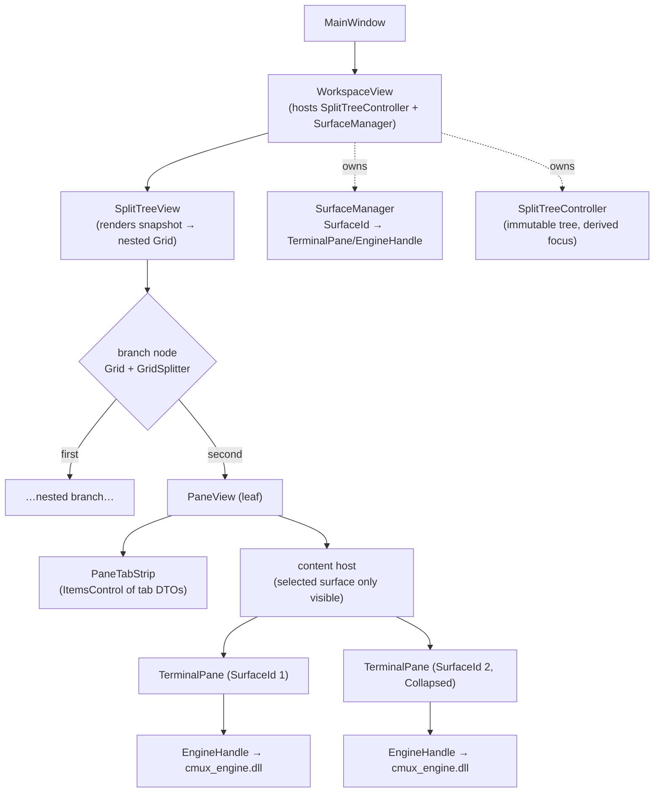
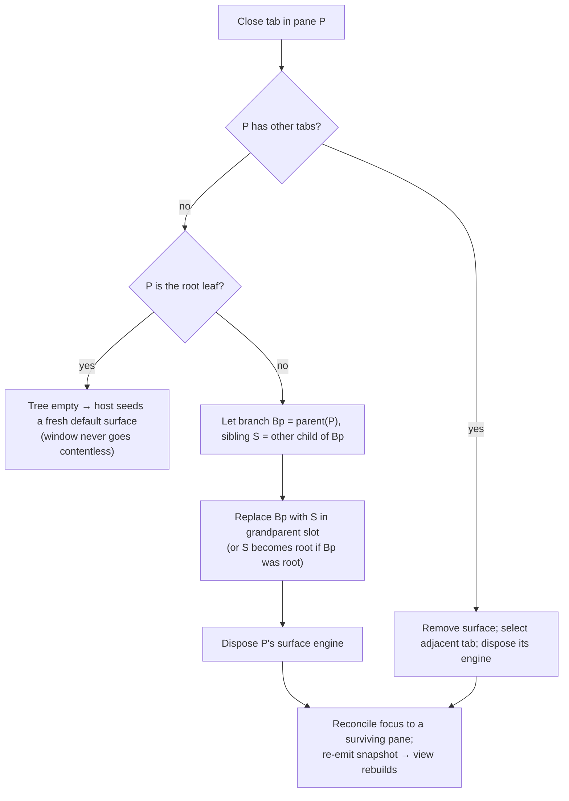

# Phase 2 — Tabs + split panes

## Summary

Turn the single-pane Phase-1 skeleton into a multi-surface workspace: a binary
split tree of panes, each pane holding a tab list, where every tab is a live
terminal surface backed by its own Phase-1 engine. This is **value-add #3** from
the master plan (`docs/plans/2026-06-04-001-feature-cmux-windows-plan.md` §8
Phase 2) elaborated to implementation-ready depth.

Phase 2 is almost entirely a **C# effort**. The Phase-1 engine is already
one-engine-per-surface with a clean `create / attach / detach / destroy` FFI, so
splits and tabs compose existing engines from managed code with **no Rust/FFI
changes**.

---

## Problem Frame

Phase 1 proved the full stack end-to-end through exactly one terminal pane
hosted directly in `MainWindow` (`app/MainWindow.xaml` → one
`app/Controls/TerminalPane.xaml`). To become cmux rather than a single-window
terminal, the app needs the macOS bonsplit behavior: arrange many terminal
surfaces in a binary split tree, group surfaces as tabs within a pane, move
focus between panes, and tear surfaces down cleanly. The split/tab model is
ported from the macOS Swift app; per the scoping decision for this plan it is
reconstructed from the Swift *consumers* of bonsplit (the `cmux/vendor/bonsplit`
submodule is intentionally left uninitialized — the read-only reference clone is
not modified). Divider math and reorder rules are refinable at build time if a
detail proves load-bearing.

The build-order rationale in the master plan (§8) puts splits second because
they are a self-contained extension of Phase 1 — no dependency on the
notification store (Phase 3), the CLI/IPC layer (Phase 4), or the sidebar
(Phase 5).

---

## Requirements

### Tabs and surfaces

- R1. Multiple tabs (surfaces) can coexist within a single pane; each tab is
  backed by its own engine instance (`EngineHandle` → ConPTY + render thread).
- R2. Creating a new tab spawns a new shell surface and selects it; closing a
  tab tears down that surface's engine cleanly (render thread stopped before its
  `SwapChainPanel` is disposed).
- R3. Selecting a tab makes that surface the only visible/composited surface in
  the pane and focuses it; non-selected surfaces in the pane are not composited.

### Splits and layout

- R4. A focused pane can be split horizontally (stacked) or vertically
  (side-by-side), producing a binary tree of panes; nested H/V splits are
  supported to arbitrary depth.
- R5. Dividers are draggable to resize adjacent panes; a divider position is a
  fraction clamped to `[0,1]`; an "equalize" action resets every divider to
  `0.5`.
- R6. Closing the last tab in a pane removes the pane and heals the tree — the
  removed leaf's sibling is promoted into the parent branch's slot — with focus
  reconciled to a surviving pane.

### Focus and input

- R7. Exactly one pane is focused at a time; the focused surface is **derived**
  from `(focusedPaneId, selectedTab(focusedPaneId))` and is never stored
  independently.
- R8. Keyboard shortcuts route to the focused pane: directional pane navigation
  (left/right/up/down), next/previous tab, new tab, close tab, split
  horizontal, split vertical, and equalize. Focusing a pane or selecting a tab
  programmatically focuses that surface's `SwapChainPanel`.

### Lifecycle, correctness, and performance

- R9. Closing the window tears down every surface's engine in the correct order
  with no crash and no leaked render threads or PTYs.
- R10. Restructuring the tree (split, close, tab switch) never destroys or
  recreates a surviving surface's engine; live surfaces are re-parented, not
  rebuilt.
- R11. Live `SwapChainPanel` composition is bounded — inactive surfaces are
  collapsed (removed from the composition tree) — to respect the
  SwapChainPanel perf guidance (master plan §5.4, risk #9).
- R12. Layout (tree shape, tabs, divider positions, focus) is stable for the
  duration of a session. Cross-restart persistence is out of scope.

---

## Key Technical Decisions

- KTD1. **One engine instance per surface.** No shared-device multiplexing of
  one wgpu device across surfaces. Each surface keeps its Phase-1
  `EngineHandle` (own render thread, ConPTY, wgpu device + DX12 swapchain).
  Rationale: background shells must stay alive regardless of visibility, so the
  engine is resident per surface anyway; per-engine devices isolate failures and
  match the Phase-1 design exactly (master plan Phase 2 unit 3). No FFI change.

- KTD2. **`SwapChainPanel`-per-surface, collapse inactive (default).** Each
  surface owns its `TerminalPane` (panel + engine), attached once and never
  re-attached; inactive tabs are set `Visibility=Collapsed` (removed from
  composition, so they do not count against the ~4-live-panel guidance).
  *Alternative (documented escape hatch):* a bounded panel pool of one panel per
  visible leaf, with engines detaching/reattaching on tab switch. Default
  rationale: the wgpu↔`SwapChainPanel` attach seam is the project's #1 risk
  (master plan risk #1); re-exercising it on every tab switch is the riskiest
  possible choice. Collapsed panels cost GPU memory (swapchain buffers) but not
  composition; switch to the pool only if GPU-memory/panel pressure is measured.

- KTD3. **Pure-logic split-tree model in a new `Cmux.Core` library.** The tree,
  controller, IDs, snapshots, divider math, focus derivation, and directional
  navigation live in a plain `net9.0` class library with no WinUI dependency, so
  the core is unit-testable without a UI host. The model is an **immutable tree +
  a mutable controller** that emits **value-type snapshots**; focus is derived,
  never stored. `Cmux.Core` also becomes the natural home for the notification
  store (Phase 3) and workspace model (Phase 5).

- KTD4. **`GridSplitter` from `CommunityToolkit.WinUI.Controls.Sizers`.** WinUI 3
  / Windows App SDK ships no `GridSplitter`. Use the CommunityToolkit Sizers
  package rather than hand-rolling a `Thumb`-based splitter (well-tested, matches
  the divider drag behavior, far less code). Verify the package version is
  compatible with the pinned WinAppSDK 1.7 at implementation time.

- KTD5. **Custom lightweight per-pane tab strip, not `TabView`.** Render the tab
  headers as an `ItemsControl` bound to **value-type tab DTO snapshots**, with a
  separate content host that shows only the selected surface. Rationale:
  establishes the issue-#2586 snapshot-boundary discipline (DTO rows, never live
  observables) early — the same discipline the sidebar requires in Phase 5 — and
  avoids `TabView`'s content-ownership and animation behavior fighting
  `SwapChainPanel` composition. `TabView`-as-header-strip is the documented
  alternative if the custom strip's polish lags.

- KTD6. **Value-type IDs.** `readonly record struct PaneId` and
  `readonly record struct SurfaceId`, each wrapping a monotonically increasing
  `int` from a per-controller counter. IDs are never reused within a session, so
  a stale snapshot can never alias a new pane/surface.

- KTD7. **Divider position as a fraction in `[0,1]`.** Stored per branch
  (default `0.5`, clamped on every write), mapped to two star-sized `Grid`
  tracks (`fraction*` / `(1-fraction)*`). Equalize resets all to `0.5`.
  Orientation convention, stated explicitly to avoid the perennial axis
  confusion: `Orientation.Vertical` = panes **side-by-side** separated by a
  **vertical** divider (the "split right" action); `Orientation.Horizontal` =
  panes **stacked** separated by a **horizontal** divider (the "split down"
  action).

- KTD8. **No new FFI / no Rust changes.** Phase 2 composes multiple Phase-1
  engines purely from C#. If profiling later shows background surfaces wasting
  GPU rendering into collapsed panels, an optional `cmux_engine_set_active(bool)`
  hint is a Phase-6 perf follow-up — explicitly out of this phase.

- KTD9. **Engine lifecycle decoupled from XAML `Loaded`/`Unloaded`.** Today
  `TerminalPane` shuts the engine down on `Unloaded`. Tree restructuring
  re-parents leaf panes, which fires `Unloaded`/`Loaded` — so teardown must be
  **explicit and idempotent** (driven by the surface manager on tab/pane close),
  and `AttachSwapChainPanel` must run **exactly once** (guarded against the
  re-`Loaded` that re-parenting triggers). This is the single most important
  correctness change in the phase (see R10).

---

## High-Level Technical Design

### Containment and ownership



Two ownership planes, deliberately separated:

- The **model plane** (`SplitTreeController`, `Cmux.Core`) knows only IDs,
  orientations, divider fractions, tab order, and focus — no XAML, no engines.
- The **surface plane** (`SurfaceManager`, `app/`) maps `SurfaceId` → live
  `TerminalPane`/`EngineHandle`. The view rebuilds `Grid` structure from
  snapshots but **re-parents the same `TerminalPane` instances** by `SurfaceId`
  (R10) rather than recreating them.

### Close-last-tab → tree heal



---

## Output Structure

```
C:\dev\Cmux_windows\
├─ core\
│  └─ Cmux.Core.csproj                 (net9.0, no WinUI)
│     └─ Splits\
│        ├─ Ids.cs                      (PaneId, SurfaceId record structs)
│        ├─ SplitTree.cs                (immutable node model + snapshots)
│        ├─ SplitTreeController.cs      (mutable controller; ops + derived focus)
│        └─ LayoutGeometry.cs           (leaf rects + directional navigation)
├─ tests\
│  └─ Cmux.Core.Tests.csproj           (net9.0, xUnit)
│     └─ Splits\SplitTreeControllerTests.cs, LayoutGeometryTests.cs
├─ app\
│  ├─ Cmux.App.csproj                   (+ ProjectReference Cmux.Core;
│  │                                       + CommunityToolkit.WinUI.Controls.Sizers)
│  ├─ MainWindow.xaml(.cs)              (hosts WorkspaceView; full teardown)
│  ├─ Controls\TerminalPane.xaml(.cs)   (MODIFIED: explicit teardown, once-attach,
│  │                                       SurfaceId, focus + active toggle)
│  └─ Splits\
│     ├─ WorkspaceView.xaml(.cs)        (owns controller + SurfaceManager)
│     ├─ SplitTreeView.cs               (snapshot → nested Grid/GridSplitter)
│     ├─ PaneView.xaml(.cs)             (tab strip + content host)
│     ├─ PaneTabStrip.xaml(.cs)         (ItemsControl of tab DTO snapshots)
│     ├─ SurfaceManager.cs              (SurfaceId → TerminalPane; lifecycle)
│     └─ ShortcutRouter.cs              (keyboard accelerators → controller)
```

The per-unit `Files:` sections remain authoritative; the implementer may adjust
this layout.

---

## Implementation Units

### U1. Testable split-tree core (`Cmux.Core` + tests)

- **Goal:** the pure, UI-free heart of Phase 2 — the immutable tree, the mutable
  controller, value-type IDs and snapshots, divider math, derived focus, and
  directional navigation — plus the test project and comprehensive coverage.
- **Requirements:** R4, R5, R6, R7 (model side), R12.
- **Dependencies:** none.
- **Files:**
  - Create `core/Cmux.Core.csproj` (`net9.0`, nullable enabled, no WinUI).
  - Create `core/Splits/Ids.cs`, `core/Splits/SplitTree.cs`,
    `core/Splits/SplitTreeController.cs`, `core/Splits/LayoutGeometry.cs`.
  - Create `tests/Cmux.Core.Tests.csproj` (`net9.0`, xUnit, references core).
  - Create `tests/Splits/SplitTreeControllerTests.cs`,
    `tests/Splits/LayoutGeometryTests.cs`.
- **Approach:**
  - `PaneId` / `SurfaceId` are `readonly record struct`s over an `int` issued by
    a per-controller monotonic counter (never reused — KTD6).
  - `SplitNode` is a discriminated union (sealed base + `PaneLeaf` / `SplitBranch`
    records, or an abstract record hierarchy):
    - `PaneLeaf { PaneId Id, ImmutableList<SurfaceId> Tabs, SurfaceId Selected }`
    - `SplitBranch { Orientation Orientation, SplitNode First, SplitNode Second, double DividerPosition }`
  - `SplitTreeController` holds the current root + `focusedPaneId`, exposes
    operations and a `TreeSnapshot()` that returns immutable value types. Public
    surface (port of the bonsplit controller):
    `Split(PaneId, Orientation, bool insertFirst)`, `NewTab(PaneId)`,
    `CloseTab(SurfaceId)`, `SelectTab(PaneId, SurfaceId)`,
    `SelectNextTab()/SelectPreviousTab()`, `FocusPane(PaneId)`,
    `MoveFocus(Direction)`, `SetDividerPosition(branchPath, double)`,
    `Equalize()`, `AllPaneIds`, `FocusedPaneId`, `FocusedSurface`,
    `Tabs(PaneId)`, `SelectedTab(PaneId)`.
  - **Derived focus (R7):** `FocusedSurface => SelectedTab(FocusedPaneId)`. Never
    stored; changing the selected tab changes the focused surface.
  - **Tree heal (R6):** on closing a leaf's last tab, replace `parent(leaf)` with
    the leaf's sibling in the grandparent slot (sibling becomes root if parent
    was root); closing the last surface of the root leaf yields an empty tree and
    the controller raises an "empty" signal for the host to re-seed.
  - **Divider math (KTD7):** clamp on every write; `Equalize()` sets all branch
    dividers to `0.5`.
  - **`LayoutGeometry`:** given the tree and a unit rectangle, compute each
    leaf's normalized rect by recursively splitting on orientation + divider
    fraction; `MoveFocus(Direction)` picks the nearest leaf whose center lies in
    the requested direction with axis overlap preference. Pure and testable.
- **Patterns to follow:** mirror the macOS bonsplit invariants from
  `cmux/Sources/Workspace.swift` (derived `focusedPanelId`, divider clamp
  `min(max(x,0),1)`, sibling-promotion on pane close). Use `System.Collections.Immutable`.
- **Test scenarios** (`tests/Splits/SplitTreeControllerTests.cs` unless noted):
  - Covers R4. Initial controller: one `PaneLeaf`, one `SurfaceId`, that surface
    selected and that pane focused.
  - Covers R4. `Split(root, Vertical, insertFirst:false)` → root is a
    `SplitBranch{Vertical, First=original, Second=new}`, divider `0.5`; new pane
    has exactly one new surface, selected and focused.
  - Covers R4. `Split(..., insertFirst:true)` places the new pane as `First`.
  - Covers R4. Nested split: split a child pane → depth-2 tree; `AllPaneIds`
    enumerates all three leaves.
  - Covers R6. `CloseTab` on a 2-tab pane removes that surface, keeps the pane,
    and moves selection to an adjacent tab.
  - Covers R6. `CloseTab` on a non-root leaf's last tab promotes the sibling into
    the grandparent slot; branch count drops by one; the removed branch's divider
    is gone; focus reconciles to a surviving pane.
  - Covers R6. `CloseTab` on the only pane's last tab yields an empty tree and
    raises the empty signal exactly once.
  - Covers R5. `SetDividerPosition` clamps inputs `< 0` to `0` and `> 1` to `1`.
  - Covers R5. `Equalize()` resets every branch divider to `0.5` in a nested tree.
  - Covers R7. `FocusedSurface` equals `SelectedTab(FocusedPaneId)`; after
    `SelectTab` the focused surface changes with no separate focus mutation.
  - Covers R7. `SelectNextTab`/`SelectPreviousTab` wrap within the focused pane
    and never cross panes.
  - `MoveFocus(Right)` from the left pane of a vertical split focuses the right
    pane; `MoveFocus` with no pane in that direction is a no-op (focus unchanged)
    — in `LayoutGeometryTests.cs`.
  - Directional navigation across a nested tree picks the geometrically nearest
    leaf (overlap-preferred) — in `LayoutGeometryTests.cs`.
  - R12 / KTD6. `TreeSnapshot()` returns value types: a captured snapshot is
    unchanged after subsequent controller mutations; closed IDs are never
    reissued to new panes/surfaces.
- **Verification:** `dotnet test tests/Cmux.Core.Tests.csproj` passes; the core
  builds with no WinUI reference.

### U2. Surface manager + `TerminalPane` lifecycle decoupling

- **Goal:** bridge model IDs to live engines, and fix the `Unloaded`-teardown
  trap so the tree can be restructured without destroying surviving shells.
- **Requirements:** R1, R2 (teardown), R9, R10.
- **Dependencies:** U1.
- **Files:**
  - Create `app/Splits/SurfaceManager.cs`.
  - Modify `app/Controls/TerminalPane.xaml.cs`.
- **Approach:**
  - **Modify `TerminalPane`:** remove the `Unloaded → Shutdown` wiring; add an
    `_attached` guard so `AttachSwapChainPanel` runs once on the first `Loaded`
    and is a no-op on the re-`Loaded` that re-parenting triggers (KTD9, R10);
    make `Shutdown()` idempotent; add a `SurfaceId` property, constructor
    parameters for `SurfaceId` + optional `cwd`/`cmdline`, a `FocusSurface()`
    method (`Panel.Focus(Programmatic)`), and a `SetActive(bool)` that toggles
    `Visibility` (Collapsed when inactive — R3, R11). Route the engine's `Title`
    `HostEvent` to an event the manager forwards to the tab DTO.
  - **`SurfaceManager`:** `IReadOnlyDictionary<SurfaceId, TerminalPane>` plus
    `CreateSurface(SurfaceId, cwd?)`, `DisposeSurface(SurfaceId)`,
    `DisposeAll()`. Teardown order per surface: `TerminalPane.Shutdown()`
    (engine `Dispose` → render thread stops → ConPTY closes) **then** release the
    panel's COM ref (already the Phase-1 order). Depend on an `ISurfaceFactory`
    seam so the manager is unit-testable with a fake that records create/dispose
    calls and ordering without real engines.
- **Patterns to follow:** the existing Phase-1 teardown ordering in
  `TerminalPane.Shutdown()` (engine dispose before `Marshal.Release`); the
  `EngineHandle` API surface (`CreateDefault`, `SpawnShell`, `Dispose`).
- **Test scenarios** (`tests/Splits/SurfaceManagerTests.cs`, fake factory):
  - Covers R1. `CreateSurface` instantiates exactly one surface per `SurfaceId`;
    creating a second id leaves the first intact.
  - Covers R2/R9. `DisposeSurface` disposes only the targeted surface; the fake
    records engine-dispose-before-panel-release ordering.
  - Covers R9. `DisposeAll` disposes every surface exactly once.
  - Covers R10. Re-parent simulation: a `Loaded`→`Unloaded`→`Loaded` sequence on
    a `TerminalPane` does not dispose the engine and does not re-attach the panel
    (assert attach count stays 1, dispose count stays 0). *(May require a thin
    seam over attach/dispose to observe counts; if a real `TerminalPane` can't be
    instantiated headless, cover this via the `ISurfaceFactory` fake and a logic
    test of the `_attached`/idempotent-shutdown guards.)*
- **Verification:** unit tests pass; manual smoke — re-parenting a pane (via a
  split in U6) keeps its shell alive and its content rendering.

### U3. Split-tree WinUI rendering (`SplitTreeView`)

- **Goal:** render a tree snapshot into a nested `Grid` + `GridSplitter` visual,
  re-parenting live `PaneView`s, and feed divider drags back to the controller.
- **Requirements:** R4, R5, R10, R11.
- **Dependencies:** U1, U2.
- **Files:**
  - Create `app/Splits/SplitTreeView.cs`.
  - Modify `app/Cmux.App.csproj` (add `ProjectReference` to `Cmux.Core`; add
    `CommunityToolkit.WinUI.Controls.Sizers` package).
- **Approach:**
  - Recursively materialize the snapshot: a `SplitBranch` → a `Grid` with two
    star-sized tracks (`fraction*` / `(1-fraction)*`) — columns for
    `Orientation.Vertical`, rows for `Orientation.Horizontal` (KTD7) — and a
    `GridSplitter` between them; a `PaneLeaf` → the leaf's `PaneView`.
  - **Re-parent, don't rebuild (R10):** keep a `PaneId → PaneView` cache; on
    rebuild, detach existing `PaneView`s from their old parents and place the same
    instances into the new `Grid`. Never recreate a `PaneView`/surface that still
    exists in the new snapshot.
  - **Divider drag → fraction:** on `GridSplitter` drag-complete, read the two
    tracks' star values, convert to a `[0,1]` fraction, and call
    `controller.SetDividerPosition(...)`. Conversion math is pure → unit-test it
    in `Cmux.Core` (`LayoutGeometry`).
  - Rebuild is triggered by the controller's snapshot-changed event; structural
    changes (split/close) are infrequent so a full Grid rebuild (with cached
    `PaneView` re-parenting) is acceptable.
- **Patterns to follow:** `CommunityToolkit.WinUI.Controls.GridSplitter` docs for
  star-resize behavior; the recursive `sessionLayoutSnapshot` walk in
  `cmux/Sources/Workspace.swift` as the tree-walk shape.
- **Test scenarios:**
  - Star-ratio ↔ `[0,1]` fraction conversion round-trips and clamps (pure, in
    `LayoutGeometryTests.cs`).
  - Manual/acceptance: split right then split down yields the expected nested
    layout; dragging a divider resizes adjacent panes and the new fraction
    survives a subsequent unrelated rebuild; re-parented panes keep rendering.
  - `Test expectation: none` for the XAML composition wiring itself beyond the
    pure conversion test — covered by acceptance.
- **Verification:** building the app resolves the new package and project
  reference; nested splits render and dividers drag (acceptance criteria below).

### U4. Pane view + per-pane tab strip

- **Goal:** the leaf UI — a tab strip of value-type DTO headers and a content
  host that shows only the selected surface.
- **Requirements:** R1, R2, R3, R5 (equalize button optional), R11.
- **Dependencies:** U2, U3.
- **Files:**
  - Create `app/Splits/PaneView.xaml(.cs)`, `app/Splits/PaneTabStrip.xaml(.cs)`.
- **Approach:**
  - `PaneView` shows a `PaneTabStrip` above a content host (a `Grid`/`Panel`)
    that contains the pane's surfaces' `TerminalPane`s; only the selected
    surface is `Visible`, the rest `Collapsed` via `TerminalPane.SetActive`
    (R3, R11).
  - `PaneTabStrip` is an `ItemsControl` bound to an `ImmutableArray<TabHeaderDto>`
    (KTD5): `record TabHeaderDto(SurfaceId Id, string Title, bool IsSelected)`.
    The DTO list is recomputed on the UI thread from the controller snapshot +
    engine title events — **never** bound to a live observable surface object
    (issue-#2586 discipline). Tab click → `controller.SelectTab`; close button →
    `controller.CloseTab`; a "+" button → `controller.NewTab`.
  - On selection change, call `SurfaceManager` to toggle active surface and
    `FocusSurface()` the newly selected one.
- **Patterns to follow:** the macOS `BonsplitTabBar` consumer shape (title/icon
  per tab, close + new affordances); value-type DTO rows (the same pattern the
  Phase-5 sidebar mandates).
- **Test scenarios:**
  - `TabHeaderDto` projection from a controller snapshot is a pure function →
    unit-test that a pane with 3 tabs yields 3 DTOs with exactly one
    `IsSelected` (in `Cmux.Core` if the projection lives there, else a small
    app-side test).
  - Manual/acceptance: new-tab adds a header and spawns a shell; selecting a tab
    swaps the visible surface and focuses it; closing a non-last tab keeps the
    pane; a title-change OSC updates the tab header text.
- **Verification:** tabs open/close/select within a pane; only one surface
  visible per pane; acceptance criteria met.

### U5. Focus routing + keyboard shortcuts

- **Goal:** wire keyboard accelerators to controller operations against the
  focused pane, and keep XAML focus in sync with derived model focus.
- **Requirements:** R7, R8.
- **Dependencies:** U3, U4.
- **Files:**
  - Create `app/Splits/ShortcutRouter.cs`.
  - Modify `app/Splits/WorkspaceView.xaml(.cs)` (see U6) to host accelerators.
- **Approach:**
  - Register `KeyboardAccelerator`s (or a window-level `PreviewKeyDown` handler)
    for: focus left/right/up/down, next/prev tab, new tab, close tab, split
    horizontal, split vertical, equalize. Map to controller calls; defaults
    ported from `cmux/Sources/KeyboardShortcutSettings.swift` adapted to Windows
    chords (e.g. Ctrl+Shift+D split, Ctrl+Shift+arrows focus move) — finalize
    exact chords at build time, avoiding collisions with terminal control keys.
  - After any focus-changing op, read `controller.FocusedSurface` and call
    `SurfaceManager`'s `TerminalPane.FocusSurface()` so OS keyboard focus follows
    derived model focus (R7/R8). Accelerators must not steal keys destined for
    the focused terminal — gate on modifier chords only.
- **Patterns to follow:** Phase-1 input forwarding in `TerminalPane`
  (`InputKeyboardSource.GetKeyStateForCurrentThread` for modifiers); the macOS
  shortcut action enum names.
- **Test scenarios:**
  - The router's chord → operation mapping is a pure table → unit-test that each
    chord resolves to the intended controller call (mapping in `Cmux.Core` or an
    app-side fake controller asserting the call).
  - Directional focus already covered by `LayoutGeometryTests` (U1).
  - Manual/acceptance: split, then move focus across panes by keyboard; new/close
    tab and split via keyboard; the terminal still receives normal keystrokes
    (no accelerator shadowing of plain keys).
- **Verification:** every R8 action is reachable by keyboard and routes to the
  focused pane; OS focus follows the focused surface.

### U6. `WorkspaceView` + `MainWindow` integration and full teardown

- **Goal:** assemble the pieces into a single hosted view, seed the initial
  surface, and tear every engine down on window close.
- **Requirements:** R9, R10, R12.
- **Dependencies:** U2, U3, U4, U5.
- **Files:**
  - Create `app/Splits/WorkspaceView.xaml(.cs)`.
  - Modify `app/MainWindow.xaml`, `app/MainWindow.xaml.cs`.
- **Approach:**
  - `WorkspaceView` owns a `SplitTreeController` + `SurfaceManager` + the
    `SplitTreeView`; on construction it seeds one pane with one surface
    (preserving Phase-1 behavior: a single working terminal on launch). It
    subscribes to the controller's snapshot-changed event to drive `SplitTreeView`
    rebuilds and to the controller's "empty" signal to re-seed a fresh surface
    (so the window never goes contentless — see HTD heal flow).
  - `MainWindow.xaml` replaces the single `<TerminalPane>` with
    `<splits:WorkspaceView>`. `MainWindow` `Closed` calls
    `WorkspaceView.ShutdownAll()` → `SurfaceManager.DisposeAll()` (each surface
    torn down in the correct order — R9). Window title reflects the focused
    surface's title.
- **Patterns to follow:** existing `MainWindow.OnClosed → Pane.Shutdown()` and
  title-forwarding wiring (now sourced from the focused surface).
- **Test scenarios:**
  - `DisposeAll` ordering/coverage already covered in U2 (fake factory).
  - Manual/acceptance: launch shows one working terminal; build a 3-pane,
    multi-tab layout; close the window → process exits cleanly, no orphan render
    threads/PTYs (verify via Task Manager / engine log), no crash dialog.
- **Verification:** the full Phase-2 acceptance criteria below pass end-to-end.

### U7. Pane zoom (optional / stretch)

- **Goal:** toggle the focused leaf to fill the workspace and back, matching the
  macOS `toggleSplitZoom`.
- **Requirements:** extends R8 (one more keyboard action); no new hard
  requirement.
- **Dependencies:** U3, U5.
- **Files:** modify `app/Splits/WorkspaceView.xaml.cs`,
  `app/Splits/SplitTreeView.cs`; add a `bool IsZoomed`/`ZoomedPane` to the
  controller in `core/Splits/SplitTreeController.cs`.
- **Approach:** when zoomed, `SplitTreeView` renders only the focused leaf's
  `PaneView` full-bleed (others Collapsed, engines untouched); toggling restores
  the snapshot layout. Zoom is transient view state, not persisted in the tree.
- **Test scenarios:**
  - Controller `ToggleZoom`/`ClearZoom` state transitions are pure → unit-test.
  - Manual/acceptance: zoom focuses one pane full-window; un-zoom restores the
    exact prior layout and divider positions.
- **Verification:** zoom toggles without disturbing other surfaces' engines.
  *This unit may be deferred to Phase 2.5 alongside drag-and-drop if Phase 2
  scope needs trimming.*

---

## Scope Boundaries

### Deferred to Follow-Up Work (Phase 2.5)

- Tab and pane **drag-and-drop reordering** (`tab.dragStart`/`tab.drop`/
  `pane.drop` in the macOS vocabulary). Confirmed deferred for this plan; the
  controller's tab list and tree ops are designed so reorder/move-tab can be
  added without reshaping the model.
- Pane zoom (U7) may slip here if Phase 2 scope needs trimming.

### Deferred for later (other phases)

- Browser/WebView2 splits (`splitBrowserRight`/`splitBrowserDown`) → Phase 6.
- Sidebar / multi-workspace (a workspace owns one tree) → Phase 5. Phase 2 is a
  single window with a single split tree.
- GPU "throttle when hidden" optimization (optional `cmux_engine_set_active`) →
  Phase 6 perf (KTD8).
- Cross-restart session layout persistence (the macOS `SessionWorkspaceLayout`
  snapshot persistence) — R12 only requires within-session stability.

### Outside this phase's identity

- **No Rust/FFI changes.** Phase 2 is C#-only; the VT/render/ConPTY core is
  untouched. Any temptation to add engine entry points belongs to a later phase.
- No multiple top-level windows.

---

## System-Wide Impact

- **Engine lifecycle becomes a managed, multi-instance concern.** Phase 1 had a
  one-engine invariant tied to one window; Phase 2 makes `SurfaceManager` the
  single owner of engine create/dispose, and decouples teardown from XAML
  lifecycle (KTD9). Every future surface-bearing feature (notifications routing
  in Phase 3, sidebar in Phase 5) depends on this id→engine registry.
- **Snapshot-boundary discipline is established here** (value-type tab DTOs,
  KTD5) — the same rule the Phase-5 sidebar must follow to avoid the issue-#2586
  CPU spin. Getting it right in the tab strip de-risks Phase 5.
- **New solution structure:** `Cmux.Core` + a test project enter the build.
  CI/build scripts (master plan §9.3) should add `dotnet test` and the new
  project references; the engine build target is unchanged.

---

## Risks & Dependencies

- **`Unloaded`-driven teardown on re-parent (highest correctness risk).** If
  KTD9 is not implemented, splitting/restructuring destroys live shells.
  Mitigation: explicit idempotent teardown + once-guarded attach; U2 test
  asserting re-parent does not dispose/re-attach.
- **`SwapChainPanel` proliferation / GPU memory** with many collapsed surfaces
  (master plan risk #9). Mitigation: collapse inactive (R11); the pooled
  alternative (KTD2) is the documented escape hatch if measured pressure appears.
- **Focus correctness.** Derived-focus invariant (R7) is easy to regress by
  caching a focused surface. Mitigation: focus is computed in `Cmux.Core`, unit
  tested; OS focus is set *from* the derived value, never the reverse.
- **`GridSplitter` ↔ fraction fidelity.** Star-size readback must round-trip to
  `[0,1]`. Mitigation: pure conversion in `Cmux.Core` with round-trip tests.
- **Keyboard accelerator shadowing.** Accelerators must not swallow keys meant
  for the terminal. Mitigation: gate on modifier chords; manual validation that
  plain typing is unaffected.
- **Reconstructed split model.** Divider/reorder details come from Swift
  consumers, not bonsplit source. Mitigation: behavior is captured in unit tests;
  if a specific rule proves load-bearing during implementation, the submodule can
  be initialized then (with explicit confirmation) — not required now.
- **Dependency:** `CommunityToolkit.WinUI.Controls.Sizers` must be compatible
  with the pinned WinAppSDK 1.7 (verify at build time — KTD4).

---

## Acceptance Criteria (the Phase-2 bar)

- Open multiple tabs in a pane; each is an independent live shell; selecting a
  tab shows and focuses it.
- Split a pane horizontally and vertically; nested splits work to multiple
  levels; only the selected surface per pane is composited.
- Drag dividers to resize; equalize resets them; positions survive unrelated
  rebuilds.
- Move focus between panes and tabs by keyboard; new/close/split/equalize are all
  keyboard-accessible and act on the focused pane.
- Close the last tab in a pane → the pane disappears and the tree heals (sibling
  promoted); focus lands on a surviving pane; closing the very last surface
  re-seeds a fresh one.
- Restructuring the layout never kills a surviving surface's shell (R10).
- Close the window → clean teardown of every engine, no crash, no leaked render
  threads/PTYs.

---

## Sources / Research

- Current Phase-1 surface: `app/Controls/TerminalPane.xaml.cs` (lifecycle,
  `Unloaded → Shutdown` to be decoupled; attach-on-`Loaded`),
  `app/Interop/EngineHandle.cs` (per-instance engine API), `app/MainWindow.xaml`
  (flat single-pane host), `app/Cmux.App.csproj` (WinAppSDK 1.7, no
  CommunityToolkit), `engine/src/lib.rs` + `engine/src/engine.rs` (per-surface
  engine, `detach`/`destroy` already exported — confirms KTD8).
- macOS split/tab model reconstructed from bonsplit consumers:
  `cmux/Sources/Workspace.swift` (derived `focusedPanelId`, divider clamp
  `min(max(x,0),1)`, `splitPane`/`navigateFocus`/`selectTab`, `didCloseTab`/
  `didClosePane` delegates, `sessionLayoutSnapshot` tree walk),
  `cmux/Sources/KeyboardShortcutSettings.swift` (shortcut action set + defaults),
  `cmux/Sources/TabManager.swift` (divider delta resize), `cmux/Sources/SplitEqualizer.swift`
  (equalize), `cmux/cmuxTests/WorkspaceSplitStartupCommandTests.swift` (tree
  shape). `cmux/vendor/bonsplit` left uninitialized per the scoping decision.
- Master plan: `docs/plans/2026-06-04-001-feature-cmux-windows-plan.md` §5.4
  (SwapChainPanel perf), §8 Phase 2 (units + acceptance), §9.1 risks #1/#9.
- `CommunityToolkit.WinUI.Controls.Sizers` `GridSplitter` (WinUI 3 replacement
  for the absent built-in) — confirm version vs WinAppSDK 1.7 at build time.
