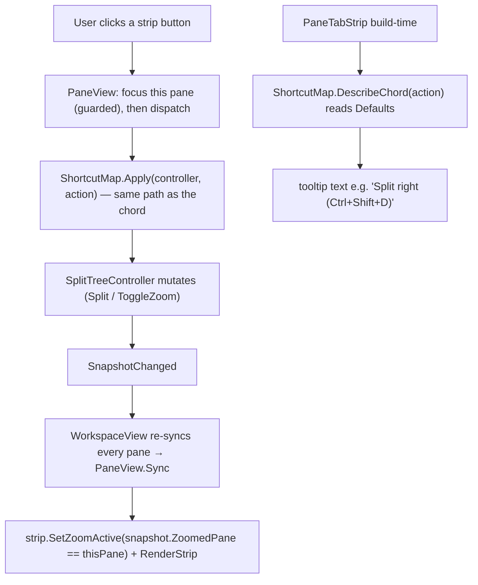

# feat: Discoverable pane controls

## Summary

Add three always-visible icon buttons — split-right, split-down, and zoom —
to each pane's tab strip beside the existing `+`, plus one small `Cmux.Core`
helper that derives each button's tooltip chord text. Every button routes
through the same keyboard dispatch path the chords already use, so it can never
drift from its shortcut. This is a view-only discoverability layer: no
controller, shortcut-table, or engine change.

---

## Problem Frame

The Phase-2 workspace exposes splitting, zoom, and equalize only through
`Ctrl+Shift+_` chords with zero on-screen trace. New-tab and close-tab already
have buttons (`+` / `✕`), and panes are click-to-focus — but split, the
headline tiling feature, is invisible. A user who hasn't read the docs has no
way to learn it exists. The friction is *discovery*, not recall (see origin:
`docs/brainstorms/2026-06-06-discoverable-pane-controls-requirements.md`).

The fix is the smallest visible affordance that advertises the feature where
the eye already goes — the tab strip — while staying within a terminal user's
tolerance for chrome. Hover tooltips carry the chord, so the buttons also
teach the keyboard over time.

---

## Key Technical Decisions

- KTD1. Buttons dispatch through `ShortcutMap.Apply`, not direct controller
  calls. Each button invokes the exact same code path the matching keyboard
  chord invokes (`ShortcutMap.Apply(controller, action)`). This guarantees
  button/chord parity by construction (R2, AE1) — a future change to what
  `SplitRight` *does* updates both surfaces at once — rather than maintaining
  two parallel call sites that can silently diverge.

- KTD2. Tooltip chord text comes from a new reverse-lookup helper in
  `Cmux.Core`, not hardcoded strings. A `ShortcutMap.DescribeChord(action)`
  method reads `ShortcutMap.Defaults` (the same table the accelerators use) and
  formats the bound chord (e.g. `"Ctrl+Shift+D"`). Sourcing the text from the
  binding means a rebound chord updates its tooltip automatically (R3), and the
  helper is unit-testable without WinUI.

- KTD3. Each button focuses its own pane before acting. The handler calls
  `FocusPane(thisPane)` (guarded, mirroring the existing `OnPaneGotFocus`
  guard) before dispatching, so the action targets the pane whose strip was
  clicked regardless of focus-event ordering (R4). This is required for zoom:
  `ToggleZoom` acts on `FocusedPane`, so the pane must be focused first.

- KTD4. The zoom button's active appearance is driven from the snapshot's
  `ZoomedPane`, read in `PaneView.Sync`. This is the only model state the view
  reads; it is a read, not a mutation (R5). Because every snapshot re-syncs all
  present panes, a pane's zoom button returns to its default look automatically
  when zoom clears.

- KTD5. The new buttons reuse the strip's existing `MakeFlatButton` helper,
  brushes, and plain text-glyph style. No icon font is introduced; the three
  icons render the same way `+` / `✕` do, so the strip reads as one coherent
  control set (R6).

- KTD6. Test scope is the `Cmux.Core` helper only. The chord-text helper gets
  automated coverage in `tests/Splits/ShortcutMapTests.cs`. The strip buttons,
  pane-view wiring, and zoom-active visual are verified manually against the
  Acceptance Examples — consistent with the existing Phase-2 view layer
  (`PaneTabStrip`, `PaneView`, `SplitTreeView`), which has no automated
  UI-test harness. Parity is enforced structurally by KTD1 rather than by a
  view-layer test.

---

## High-Level Technical Design

The buttons are alternative entry points into the existing model→view loop.
Click intent flows strip → pane view → core dispatcher → controller; the
resulting snapshot flows back to re-sync the strip (including the zoom
button's active state). Tooltip text is resolved once, at strip construction,
from the shortcut table.

---

## Requirements

These mirror the origin requirements doc and keep its R-IDs for traceability.

### Affordances

- R1. Each pane's tab strip shows persistent, always-visible icon buttons for
  split-right, split-down, and zoom, positioned beside the existing `+`.
- R2. Each button invokes the same action as its keyboard shortcut (split-right
  = `Orientation.Vertical`, split-down = `Orientation.Horizontal`, zoom =
  `ToggleZoom`). No new model behavior is introduced.
- R3. Hovering a button shows a tooltip naming the action and its current chord
  (e.g. `"Split right (Ctrl+Shift+D)"`), sourced from the same shortcut
  definition the accelerators use so the two never drift.
- R6. The new buttons match the visual language of the existing `+` / `✕`
  controls (flat style, shared sizing and brushes).

### Behavior

- R4. A button acts on the pane whose strip contains it. Clicking it focuses
  that pane first, then performs the action — consistent with click-to-focus —
  so clicking split on an unfocused pane splits *that* pane.
- R5. The zoom button reflects state: an active/toggled appearance while its
  pane is zoomed, default appearance when un-zoomed; clicking toggles between
  the two.

---

## Implementation Units

### U1. Core: tooltip chord description helper

- Goal: Provide drift-free, testable chord text for the strip tooltips by
  reverse-looking-up `ShortcutMap.Defaults` and formatting the bound chord.
- Requirements: R3 (and underpins R2 parity messaging).
- Dependencies: none.
- Files:
  - `core/Splits/Shortcuts.cs` (modify) — add `DescribeChord(ShortcutAction)`
    plus a private chord-formatting helper and a virtual-key → display-name map
    covering the codes in the existing `VKey` table.
  - `tests/Splits/ShortcutMapTests.cs` (modify) — add coverage.
- Approach: `DescribeChord` finds the first `Defaults` entry whose value equals
  the action and formats its `KeyChord` as `Ctrl(+Shift)(+Alt)(+Super)+<key>`
  in a fixed modifier order. The key-name map translates the `VKey` constants
  (`Tab`→`Tab`, `Left`/`Up`/`Right`/`Down`, `D0`→`0`, `D`/`E`/`T`/`W`/`Z` to
  their letters); unmapped codes fall back to a stable placeholder. Pure
  function, no WinRT types — stays in `Cmux.Core`.
- Execution note: Implement test-first; this is a pure function with exact
  expected outputs.
- Patterns to follow: the existing `ShortcutMap` static members (`Resolve`,
  `Apply`) and the `VKey` constant block in `core/Splits/Shortcuts.cs`; mirror
  the `[Theory]`/`[InlineData]` style already in `ShortcutMapTests.cs`.
- Test scenarios:
  - Covers R3. `DescribeChord(ShortcutAction.SplitRight)` returns
    `"Ctrl+Shift+D"`.
  - `DescribeChord(ShortcutAction.SplitDown)` returns `"Ctrl+Shift+E"`.
  - `DescribeChord(ShortcutAction.ToggleZoom)` returns `"Ctrl+Shift+Z"`.
  - Single-modifier formatting: `DescribeChord(ShortcutAction.NextTab)` returns
    `"Ctrl+Tab"` (no stray `Shift`), and `PreviousTab` returns
    `"Ctrl+Shift+Tab"`.
  - Coverage parity: every value of `ShortcutAction` yields a non-empty string
    (no action is left without a describable chord), paralleling the existing
    `Defaults_cover_every_action` test.
  - Stable modifier order: a Ctrl+Shift chord always renders `"Ctrl+Shift+…"`,
    never `"Shift+Ctrl+…"`.
- Verification: `dotnet test` passes with the new cases; the described strings
  match the chords actually present in `Defaults`.

### U2. Tab strip: persistent split/zoom buttons, events, and zoom-active visual

- Goal: Render the three new flat buttons beside `+`, raise intent events for
  them, expose tooltips sourced from U1, and reflect zoom state on the zoom
  button.
- Requirements: R1, R3, R5 (visual half), R6.
- Dependencies: U1.
- Files: `app/Splits/PaneTabStrip.cs` (modify).
- Approach: Replace the single trailing `+` in grid column 1 with a horizontal
  `StackPanel` of flat buttons — split-right, split-down, zoom, then the
  existing `+` — all built with the existing `MakeFlatButton(glyph, tooltip)`
  helper and shared brushes. Add three events
  (`SplitRightRequested` / `SplitDownRequested` / `ZoomToggleRequested`, each
  `Action`) wired to the buttons' `Click`. Compose each tooltip in the strip as
  `"<label> (" + ShortcutMap.DescribeChord(<action>) + ")"`. Keep a field
  reference to the zoom button and add `SetZoomActive(bool)` that swaps its
  foreground (`ActiveText` when zoomed, `MutedText` otherwise) and optionally
  its background (`SelectedChip`) to signal the toggled state. The existing
  `Render(headers)` continues to rebuild only the tab chips; the new buttons
  are persistent chrome like `+`.
- Patterns to follow: the existing `+` button construction and
  `MakeFlatButton` in `app/Splits/PaneTabStrip.cs`; the brush constants
  (`MutedText`, `ActiveText`, `SelectedChip`, `Transparent`) already defined
  there.
- Technical design (directional, not specification): glyphs render as plain
  `TextBlock` text like `+` / `✕`; candidate symbols are split-right `◧`,
  split-down `⬓`, zoom `⛶` — the implementer may substitute clearer glyphs, as
  glyph choice is a legibility detail, not a contract.
- Test scenarios: `Test expectation: none` — WinUI view component with no
  automated UI-test harness in this project (matches the existing
  `PaneTabStrip`). Behavior is covered manually via AE1 and AE3 and by U1's
  Core tests for the tooltip text.
- Verification: build succeeds; in a running window each pane's strip shows the
  three buttons beside `+` in the existing flat style (R1, R6); hovering shows
  the chord-bearing tooltips (R3); and `SetZoomActive(true/false)` visibly
  toggles the zoom button's appearance (R5 visual).

### U3. Pane view: wire button events (focus-then-dispatch) and push zoom state

- Goal: Route the strip's new events through the keyboard dispatch path against
  the clicked pane, and feed the zoom-active state from each snapshot.
- Requirements: R2, R4, R5 (behavior half).
- Dependencies: U2.
- Files: `app/Splits/PaneView.cs` (modify).
- Approach: In the constructor, subscribe the three strip events to a private
  `DispatchOnThisPane(ShortcutAction)` helper that focuses this pane if it is
  not already focused (`if (_controller.FocusedPane != _paneId)
  _controller.FocusPane(_paneId);`) and then calls
  `ShortcutMap.Apply(_controller, action)` with `SplitRight` / `SplitDown` /
  `ToggleZoom`. In `Sync`, after the strip render, call
  `_strip.SetZoomActive(snapshot.ZoomedPane == _paneId)`.
- Patterns to follow: the existing strip-event wiring
  (`_strip.TabSelected += …`, etc.) and the guarded `OnPaneGotFocus` focus
  check in `app/Splits/PaneView.cs`; the snapshot read pattern in `Sync`.
- Test scenarios: `Test expectation: none` — view wiring; parity is guaranteed
  structurally by routing through `ShortcutMap.Apply` (covered by U1 and the
  existing `Apply_*` tests in `ShortcutMapTests.cs`). Behavior is verified
  manually via AE1–AE3.
- Verification: build succeeds; the manual Acceptance Examples below all hold in
  a running window.

---

## Acceptance Examples

- AE1. Parity with the keyboard.
  - Covers R2. Given a focused pane, When the user clicks its split-right
    button, Then the result is identical to pressing `Ctrl+Shift+D` in that
    pane: a side-by-side pair with a new shell surface in the new pane.

- AE2. Buttons act on their own pane.
  - Covers R4. Given panes A (focused) and B side-by-side, When the user clicks
    split-down on B's strip, Then B becomes the acting pane and splits into a
    stacked pair, and A is left untouched.

- AE3. Zoom toggles and reflects state.
  - Covers R5. Given a pane that is not zoomed, When the user clicks its zoom
    button, Then that pane fills the workspace and the button shows its active
    state; When the user clicks again, Then the previous layout and divider
    positions are restored and the button returns to its default state.

---

## Scope Boundaries

### Deferred for later

- A visible affordance for equalize and an explicit close-pane button
  (close-pane stays implicit: closing a pane's last tab heals the tree).
- Alternative discovery surfaces set aside this round: right-click context
  menu, command palette, first-run coachmark, and a shortcut cheat-sheet / help
  overlay.
- An overflow (`⋯`) menu in the strip for less-common actions — relevant only
  if the new buttons crowd very narrow panes; not addressed now.
- Drag-to-split and other drag affordances (already a Phase-2.5 deferral).

### Outside this product's identity

- No changes to the keyboard chords themselves or to the split-tree model
  semantics — this is purely an additional, visible entry point.
- No engine / FFI / Rust work; this is a C#-only view-layer addition.

---

## Risks & Dependencies

- Strip crowding on narrow panes. Three extra flat buttons plus `+` could
  crowd a very narrow pane's strip. Low risk — the buttons are compact and the
  tab area already trims with ellipsis; an overflow menu is deferred above if
  this proves a problem in practice.
- Sequencing. Units are strictly ordered U1 → U2 → U3: U2's tooltips consume
  U1's helper, and U3's wiring consumes U2's events and `SetZoomActive`.

---

## Sources / Research

- `app/Splits/PaneTabStrip.cs` — the per-pane strip: `+` / `✕` chips, shared
  brushes, and `MakeFlatButton`. The new icons live here and reuse its style;
  it already raises `NewTabRequested` / `TabClosed` / `TabSelected`.
- `app/Splits/PaneView.cs` — wires strip events to the `SplitTreeController`
  and holds the guarded `OnPaneGotFocus` focus pattern; the new events route
  through here, and `Sync` is where the zoom-active read lands (R4, R5).
- `core/Splits/Shortcuts.cs` — `ShortcutMap.Apply` (the dispatch path the
  buttons reuse), `ShortcutMap.Defaults` (the authoritative chord source for
  R3), and the `VKey` constants the new formatter maps.
- `core/Splits/SplitTreeController.cs` — `Split(PaneId, Orientation)`,
  `ToggleZoom`, `FocusPane`, and `ZoomedPane`/snapshot zoom state the toggle's
  appearance reads.
- `core/Splits/SplitTree.cs` — `TreeSnapshot(..., PaneId? ZoomedPane, ...)`,
  the snapshot field `PaneView.Sync` reads for R5.
- `tests/Splits/ShortcutMapTests.cs` — existing `Resolve`/`Apply` coverage and
  test style to mirror for the new `DescribeChord` cases.
