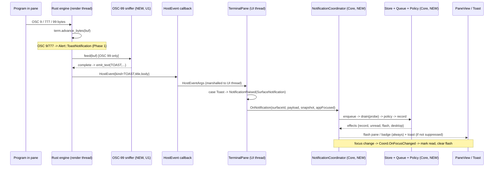

# feat: Phase 3 — notification system

## Summary

Make terminal notifications visible. When a program in a pane fires a
notification escape sequence (OSC 9, OSC 777, or OSC 99 — an AI agent finishing
a task is the headline case), the originating pane/tab shows an unread badge,
the pane flashes, and — unless that surface is already in front of the user — a
Windows desktop toast appears that focuses the surface when clicked.

The Rust engine already parses OSC 9/777 into a `TOAST` host event and the C#
interop layer already marshals every host event to the UI thread — that path is
wired but the consumer drops it on the floor. So Phase 3 is mostly a new C#
surfacing layer (`Cmux.Core` notification model + store + coalescing queue +
policy, plus app-plane flash/badge/toast), ported in intent from the macOS app
and adapted to the Phase 2 two-plane / split-tree model. One small Rust addition
adds the OSC 99 (Kitty) parser the pinned terminal core lacks.

This is value-add #2 of the three the project exists for. It depends on the
merged Phase 1 + Phase 2 work on the default branch `feat/phase1-walking-skeleton`.

---

## Problem Frame

The whole reason to build cmux instead of using a stock terminal is that it
*watches* the agents running inside it. An agent that finishes, errors, or needs
input emits a notification escape sequence; a plain terminal swallows it. cmux
must catch it and pull the user's attention to the right pane.

Phase 1 already did the hard half in the engine: `wezterm-term`'s `AlertHandler`
turns OSC 9 and OSC 777 into `Alert::ToastNotification { title, body }`, and the
engine emits that as a `HostEvent { kind = TOAST }` on the render thread
(`engine/src/vt.rs`, `engine/src/ffi/events.rs`). The C# `EngineHandle` callback
copies the borrowed strings and hops to the UI thread
(`app/Interop/EngineHandle.cs`). But `TerminalPane.OnHostEvent`
(`app/Controls/TerminalPane.xaml.cs`) only handles `Title` and `ChildExit` — the
`Toast` case is absent, so notifications vanish. `ISurface` exposes no
notification event at all.

So the gap is: (1) the engine can't see OSC 99 yet, (2) nothing in C# consumes
the toast events that already arrive, and (3) there is no model for tracking,
coalescing, de-duping, and surfacing them. Phase 3 closes all three.

The hardest part is **not** the logic — it's that this app is *unpackaged*, and
unpackaged WinUI 3 apps need explicit COM-activation registration to raise
real Windows toasts and receive their click callbacks. That work is isolated
into the final unit so the rest of the feature ships regardless (see KTD8).

---

## Key Technical Decisions

- KTD1. **Reuse the dormant TOAST path; no new FFI.** The engine already emits
  `event_kind::TOAST` (value `0`) carrying title + body, and `EngineHandle`
  already delivers `HostEventArgs(Kind, Title, Body, Arg0)` on the UI thread. The
  C# bridge is just a new `case HostEventKind.Toast` in
  `TerminalPane.OnHostEvent` that raises a new `ISurface.NotificationRaised`
  event. The `HostEvent` repr(C) struct, the `[UnmanagedCallersOnly]` callback,
  and the marshalling are untouched (R1, AE3).

- KTD2. **OSC 99 is a stateful sniffer in the engine, reusing the toast path.**
  The pinned `wezterm-term` (git tag `20240203-110809-5046fc22`) has no OSC-99
  `Alert` variant, and there is exactly one byte-ingest point
  (`term.advance_bytes(&buf)` in `engine/src/engine.rs`). A new scanner in
  `engine/src/vt.rs`, held in `RenderState` so partial sequences survive across
  PTY read bursts, is fed the same `&buf` and on a complete
  `ESC ] 99 ; <params> ; <payload> (ST|BEL)` calls the **existing**
  `sink.emit_text(event_kind::TOAST, title, body, 0)`. No new FFI surface, no new
  event kind — OSC 99 becomes indistinguishable downstream from OSC 9/777 (R1, AE3).

- KTD3. **Two-plane split, mirroring Phase 2.** All pure logic — the
  notification model, store, coalescing queue, policy, and the coordinator that
  ties them together — lives in `Cmux.Core` (`net9.0`, no WinUI) and is fully
  unit-tested. Only *surfacing* lives in the app plane: raising the per-surface
  event (`TerminalPane`), flash/badge rendering (`PaneView`/`PaneTabStrip`), and
  the OS toast. This is the same model-plane/surface-plane boundary Phase 2
  established, and it keeps the entire decision logic testable without a
  DispatcherQueue or a live window.

- KTD4. **The queue drains as a pure synchronous method.** Coalescing, the
  max-16-per-drain cap, and orphan-dropping are a pure function over the pending
  list plus a target-existence probe (`Func<SurfaceId, bool>`) and a delivery
  callback; `Drain` returns whether more entries remain. WorkspaceView owns the
  only timing/threading concern: it schedules the drain on the `DispatcherQueue`,
  guarded by a `_drainScheduled` flag and re-enqueueing while `Drain` reports
  `moreRemain` (so it neither double-fires per notification nor strands the
  remainder after a 16-item cap). This makes the trickiest behavior
  (coalescing/cap/revalidation) deterministically testable, and leaves only the
  thin debounce loop on the UI thread (R5, KTD3).

- KTD5. **Target revalidation uses `snapshot.Root.FindContaining(surfaceId)`.**
  A queued notification whose surface no longer exists is dropped before
  delivery. Because Phase 2 never reissues IDs (its KTD6, test
  `Closed_ids_are_never_reissued`), a stale `SurfaceId` can never alias a newer
  surface — so `FindContaining(...) is null` is a sound liveness test (R5, AE5).

- KTD6. **Read/unread and delivery-suppression are derived, not stored on
  surfaces.** "Is this surface in front of the user right now" = the snapshot's
  focused surface equals `s` AND its pane is the selected tab AND (no zoom, or
  the zoom is on its pane) AND the app window is foreground. No notification
  "focus" flag is stored on `ISurface`. Note: the coordinator receives a value
  `TreeSnapshot`, which carries `FocusedPane`/`ZoomedPane`/`Root` but **no
  focused-surface field** — `FocusedSurface` is an instance property on the
  *controller*, not the snapshot. So the coordinator re-derives it as
  `snapshot.Root.FindPane(snapshot.FocusedPane)?.Selected` (a new
  `TreeSnapshot.FocusedSurface` helper is added in U6 to centralize this). The
  app-foreground bool is not reachable from a `UserControl`; it is pushed in from
  `MainWindow` (see U7) (R4, R6).

- KTD7. **Coalescing key is `(generation, surfaceId)`; a clear bumps the
  generation.** macOS keys on `(generation, {tabId, surfaceId})`; we drop the
  pane/tab component because a `SurfaceId` is globally unique and never reissued
  (Phase 2 `Ids.cs` / KTD6 there), so the surface alone fully identifies the
  target — nothing is lost. Rapid repeats for one surface within a generation
  collapse to the latest payload; a clear advances a monotonic generation
  counter so it acts as a boundary (a fresh post-clear notification is never
  coalesced with, or dropped alongside, pre-clear ones). Coalescing defaults on;
  the Phase 4 CLI async path will opt out so scripted notifications are never
  merged (R5).

- KTD8. **The OS toast is the final, isolated, cuttable unit.** Per the
  master-plan risk note (§9.1 risk #6) and the agreed scope: everything before
  U8 delivers value — pane flash + unread badge work with zero toast
  registration. U8 adds the unpackaged COM-activation registration and
  `AppNotificationManager` wiring as a self-contained final step, so if
  registration proves heavy it can slip to a follow-up without blocking the phase.

- KTD9. **Port the *core* machinery only; defer the rest to Phases 4–6.** The
  macOS notification subsystem is large (2294-line store, external shell-hook
  policy pipeline with JSON patch/merge and trust authorization, socket
  notification actions, TTY caller resolution, three workspace-level unread
  sets, sound staging, dock badge, cloud push). Phase 3 takes the model, store,
  coalescing queue, and a *reduced* policy (effect toggles + suppress-when-focused).
  Everything else is explicitly deferred (see Scope Boundaries) to where its
  infrastructure actually lands.

---

## High-Level Technical Design

The end-to-end path, from escape sequence to surfaced notification. Bold is new
in Phase 3; everything else exists from Phase 1/2.



Threading: the OSC parse and `emit_text` happen on the engine **render thread**;
`EngineHandle` hops to the **UI thread** before raising `NotificationRaised`;
everything from `TerminalPane` rightward runs on the UI thread, so the
coordinator and store never see concurrent access and need no locks. The queue's
drain is scheduled on the `DispatcherQueue` but its body is the pure synchronous
method of KTD4.

---

## Output Structure

New files cluster in a `Notifications/` folder in each plane, mirroring Phase 2's
`Splits/` layout.

```
core/
  Notifications/
    SurfaceNotification.cs        (U2) raw payload from the engine event
    TerminalNotification.cs       (U3) the recorded model
    NotificationStore.cs          (U3) ordered list + derived indexes
    NotificationQueue.cs          (U4) coalescing + max-16 drain + revalidate
    NotificationPolicy.cs         (U5) effect toggles + suppress-when-focused
    NotificationCoordinator.cs    (U6) wires store+queue+policy; the brain
  Splits/
    ISurface.cs                   (U2) + NotificationRaised event
    TabHeaderDto.cs               (U7) + Unread flag on the DTO; TabHeaderProjection (same file) gains an unread lookup
app/
  Controls/TerminalPane.xaml.cs   (U2) raise NotificationRaised on Toast
  Splits/
    WorkspaceView.cs              (U7) drive coordinator; drain on dispatcher
    PaneView.cs / PaneTabStrip.cs (U7) unread badge + pane flash
    ToastService.cs               (U8) AppNotificationManager + registration
engine/
  src/vt.rs                       (U1) OSC-99 sniffer
  src/engine.rs                   (U1) hold sniffer in RenderState; feed it
tests/
  Notifications/
    NotificationStoreTests.cs     (U3)
    NotificationQueueTests.cs     (U4)
    NotificationPolicyTests.cs    (U5)
    NotificationCoordinatorTests.cs (U6)
  Splits/TabHeaderProjectionTests.cs (U7) extend for unread
```

The per-unit `**Files:**` lists remain authoritative; this tree is the shape, not a contract.

---

## Requirements

- R1. Detect terminal notification escape sequences: OSC 9 and OSC 777 (already
  parsed) and OSC 99 / Kitty (new). All three reach the same C# surfacing path.
- R2. A notification surfaces in-app: the originating tab shows an unread
  badge/dot and its pane flashes briefly.
- R3. A notification raises a Windows desktop toast (unless suppressed per R4);
  clicking the toast focuses the originating pane/surface and clears its unread.
- R4. When the originating surface is already in front of the user (app
  foreground + surface focused + visible), suppress the OS toast; still record
  the notification and show a read indicator rather than an unread one.
- R5. Bursts for the same surface coalesce to the latest payload; a single drain
  delivers at most 16; notifications targeting a surface/pane that no longer
  exists are dropped before delivery; a clear acts as a coalescing boundary.
- R6. Read/unread tracking: recorded notifications start unread (unless
  suppressed-as-read); focusing a surface marks its notifications read; unread
  counts are derived per surface and per pane, and a latest-per-pane index is
  maintained to feed the Phase 5 sidebar.
- R7. Notification effects are governed by a policy with defaults: `record`,
  `markUnread`, `desktop`, `sound`, `paneFlash`, `reorderWorkspace`.

### Acceptance Examples

- AE1. `printf '\e]777;notify;Build done;tests passed\a'` in an **unfocused**
  pane → that tab gets an unread badge, the pane flashes, and a Windows toast
  appears. (R1, R2, R3)
- AE2. The same sequence in the **focused, visible** surface while the app is in
  the foreground → no toast; the notification is recorded and immediately shows
  a read indicator. (R4, R6)
- AE3. `\e]9;hello\a` (OSC 9) and an OSC 99 (Kitty) sequence each produce a
  notification surfaced identically to OSC 777. (R1)
- AE4. 20 notifications fired rapidly for one surface → they coalesce to the
  latest payload; one unread; no storm of toasts. (R5)
- AE5. A notification is queued for a surface, then that tab is closed before the
  drain runs → the notification is dropped, nothing is delivered. (R5)
- AE6. Clicking a toast focuses the originating pane/surface and clears its
  unread badge. (R3, R6)

---

## Implementation Units

Sequence: **U1 ∥ U2 → U3 → (U4 ∥ U5) → U6 → U7 → U8.** U1 (Rust) and U2 (C#
bridge) are independent and can land in either order; U2 unblocks the OSC 9/777
path immediately, U1 adds OSC 99 to the same path. The pure-Core core
(U3–U6) is the bulk and is fully unit-tested; U7 wires the UI; U8 adds the OS toast.

### U1. OSC-99 (Kitty) notification sniffer in the engine

- **Goal:** Parse `ESC ] 99 ; <params> ; <payload> (ST|BEL)` Kitty desktop
  notifications, which the pinned `wezterm-term` does not recognize, and emit
  them through the existing TOAST host-event path so they surface like OSC 9/777.
- **Requirements:** R1. Covers AE3 (OSC 99 arm).
- **Dependencies:** none (independent of U2).
- **Files:**
  - `engine/src/vt.rs` (modify — add the sniffer type + parse logic alongside `EngineAlertHandler`)
  - `engine/src/engine.rs` (modify — hold the sniffer in `RenderState`; feed it the same `&buf` as `term.advance_bytes`)
  - `engine/src/vt.rs` (test — `#[cfg(test)]` module for the sniffer)
- **Approach:** A stateful scanner that accumulates bytes only while inside an
  OSC 99 sequence and is otherwise a cheap pass-through. On a complete sequence,
  parse the Kitty grammar and call the existing
  `sink.emit_text(event_kind::TOAST, title, body, 0)`. Hold it in `RenderState`
  (constructed in `render_loop`) so a sequence split across PTY read bursts
  reassembles. Reuse the existing `SharedSink`. Do **not** re-handle OSC 9/777 —
  those already flow through `wezterm-term`; the sniffer matches only `99`.
  Cap the in-progress buffer so a malformed/never-terminated sequence can't grow
  unbounded.
- **Kitty OSC 99 grammar (get these right — the protocol is easy to mis-default):**
  `ESC ] 99 ; <metadata> ; <payload> (BEL | ST)` where `<metadata>` is
  colon-separated `key=value` pairs. Handle these keys (ignore unknowns):
  - `p=` payload type — values `title` or `body`. **Default is `title`**, *not*
    body. So a bare `ESC]99;;hello ST` is a *title* ("hello"), with empty body.
  - `d=` done flag — `d=1` (the **default**) = this is the final/only chunk;
    `d=0` = more chunks coming for this notification (accumulate). This is
    **protocol** chunking and is distinct from a payload merely being split
    across two PTY reads (**transport** chunking) — both must be handled, and
    they are independent.
  - `e=` encoding — `e=1` means the payload is **base64**; decode before use.
    (`e=0`/absent = raw UTF-8.)
  - `i=` identifier — used to correlate chunks of the same notification; carry it
    while accumulating, otherwise unused in Phase 3.
  Combine the accumulated `title` and `body` payloads into one
  `emit_text(TOAST, title, body, 0)` when the final chunk (`d=1`) arrives. If
  only a title was supplied, emit it as the title with an empty body (downstream
  C# already falls back to the tab title when title is empty).
- **Technical design (directional):** `feed(&mut self, bytes: &[u8], sink: &SharedSink)`
  with a small state enum (`Idle` → `InOsc` after `ESC ]` → confirm leading
  `99;` → accumulate until `ST`/`BEL`), plus a per-identifier accumulator holding
  partial title/body across `d=0` chunks.
- **Patterns to follow:** `EngineAlertHandler` in `engine/src/vt.rs` (how alerts
  reach `sink.emit_text`); the single ingest at `term.advance_bytes(&buf)` in
  `engine/src/engine.rs`.
- **Execution note:** test-first — encode the byte sequences as fixtures and
  assert emitted `(kind, title, body)` before wiring into the render loop.
- **Test scenarios** (Rust `#[cfg(test)]`):
  - `ESC]99;;hello<BEL>` (no metadata) → emits TOAST with title `"hello"`, empty
    body (**default `p=title`**, not body). Covers AE3.
  - `ESC]99;p=body;the body<ST>` → emits TOAST, empty title, body `"the body"`.
  - Two sequences, `p=title` then `p=body` with the same `i=`, both `d=1`-less
    first (`d=0`) then final → combine into one emit with both title and body
    (**protocol chunking**).
  - `e=1` base64 payload → decoded before emit (assert the decoded text).
  - **Transport** split: a single `d=1` sequence whose bytes are split across two
    `feed` calls → assembled, **single** emit (distinct from the `d=0` case above).
  - Both terminators: `<BEL>` (0x07) and `<ST>` (`ESC \`) accepted.
  - A buffer containing OSC 9 / OSC 777 only → sniffer emits **nothing** (no
    double-handling); passthrough leaves `advance_bytes` to do its job.
  - Never-terminated `ESC]99;` followed by 64 KiB of bytes → buffer is capped, no panic, no emit.
  - Interleaved: normal text, then an OSC 99, then normal text in one buffer → exactly one emit, surrounding bytes untouched.
  - Unknown metadata key (e.g. `u=2` urgency) → ignored, payload still parsed.
- **Verification:** `cargo test` in `engine/` passes the new module; building the
  DLL and feeding a recorded OSC-99 stream surfaces a notification in C# (manual,
  once U2 lands). Note: rebuilding the engine needs cargo (not on PATH — use the
  full `C:\Users\steve\.cargo\bin\cargo.exe`, run via Start-Process + timeout per
  the cargo-not-on-path memory).

### U2. Per-surface notification event across the FFI→C# bridge

- **Goal:** Surface the already-arriving (but dropped) `TOAST` host events as a
  typed per-surface C# event, so the OSC 9/777 path works immediately and OSC 99
  (U1) rides the same path.
- **Requirements:** R1, R2. Covers AE1/AE3 (delivery into C#).
- **Dependencies:** none (independent of U1).
- **Files:**
  - `core/Notifications/SurfaceNotification.cs` (create — `readonly record struct SurfaceNotification(string Title, string Body)`)
  - `core/Splits/ISurface.cs` (modify — add `event Action<SurfaceNotification>? NotificationRaised`)
  - `app/Controls/TerminalPane.xaml.cs` (modify — add `case HostEventKind.Toast` in `OnHostEvent` raising the event)
- **Approach:** Define the raw payload type in `Cmux.Core` (UI-free) so the event
  contract is testable and fakes can raise it. Add the event to `ISurface`
  next to `TitleChanged`. In `TerminalPane.OnHostEvent`, add the `Toast` arm:
  `NotificationRaised?.Invoke(new SurfaceNotification(e.Title ?? "", e.Body ?? ""))`.
  Already on the UI thread (post-`EngineHandle` dispatch). No FFI / interop /
  `HostEvent` struct change — `HostEventKind.Toast = 0` and `HostEventArgs`
  already exist and already carry Title/Body.
- **Patterns to follow:** the existing `case HostEventKind.Title` arm and
  `TitleChanged?.Invoke(...)` in `TerminalPane.OnHostEvent`; the plain
  `event Action<T>?` style of `ISurface.TitleChanged`.
- **Test scenarios:**
  - `SurfaceNotification` value semantics: equality by (Title, Body); a trivial Core test. Test expectation: minimal — this is a value type.
  - A test fake that raises `NotificationRaised(title, body)`, exercised by
    U3/U6 tests. Note the existing `FakeSurface` is a `private` nested class in
    `tests/Splits/SurfaceManagerTests.cs` and is **not** reusable from
    `tests/Notifications/`; either extract a shared fake into a common test
    helper or define a local fake per test file (the csproj uses SDK file
    globbing, so new `tests/Notifications/*.cs` compile with no csproj edit).
    Test expectation: the wiring in `TerminalPane` itself is app-side with no
    test project; verified by build + manual (AE1) — the behavior is proven
    through the Core fake downstream.
- **Verification:** the app builds; firing `\e]9;hi\a` / `\e]777;notify;T;B\a`
  from inside a pane raises `NotificationRaised` (observable once U6/U7 surface it).

### U3. `TerminalNotification` model + `NotificationStore`

- **Goal:** A pure, ordered notification record list with the derived indexes the
  UI and the Phase 5 sidebar need.
- **Requirements:** R2, R6.
- **Dependencies:** U2 (consumes `SurfaceNotification`).
- **Files:**
  - `core/Notifications/TerminalNotification.cs` (create)
  - `core/Notifications/NotificationStore.cs` (create)
  - `tests/Notifications/NotificationStoreTests.cs` (create)
- **Approach:** `TerminalNotification` is a `readonly record struct` with
  `{ Id (Guid), SurfaceId, PaneId, Title, Subtitle, Body, CreatedAt
  (DateTimeOffset), IsRead, PaneFlash, ClickAction? }`. Note the Phase 2 model
  has **no `TabId`** — a tab *is* a surface, so `SurfaceId` is both the tab and
  the surface key, and `PaneId` is the owning pane (resolved via the snapshot at
  record time). Title/Body come from the engine; Subtitle/Id/timestamps/PaneId
  are added here. The store owns the ordered list (newest first) and rebuilds
  derived indexes on mutation: `UnreadCount`, `UnreadCountByPane`
  (`IReadOnlyDictionary<PaneId,int>`), `UnreadByPaneSurface` (a set keyed by
  `(PaneId, SurfaceId)`), and `LatestByPane` (newest per pane — the Phase 5
  feed). De-dupe per surface: recording a notification for a surface that
  already has one replaces it (at most one live notification per surface, as in
  macOS). Mutations: `Add`, `MarkRead(id)`, `MarkRead(surfaceId)`,
  `MarkReadForPane(paneId)`, `MarkUnread(id)`, `Remove(id)`,
  `ClearForSurface(surfaceId)`, `ClearForPane(paneId)`, `ClearAll()`.
- **Patterns to follow:** `SurfaceManager` (single owner + keyed dictionaries +
  null-returning lookups, `core/Splits/SurfaceManager.cs`); `readonly record
  struct` IDs in `core/Splits/Ids.cs`.
- **Execution note:** test-first — this is new pure logic with clear inputs/outputs.
- **Test scenarios:**
  - Add one → `UnreadCount==1`, `UnreadCountByPane[pane]==1`, `LatestByPane[pane]` is it. Covers R6.
  - Add second for the **same surface** → replaces the first; still one notification for that surface.
  - Add for two surfaces in the same pane → `UnreadCountByPane[pane]==2`; `LatestByPane` is the newer.
  - `MarkRead(id)` → `UnreadCount` drops; `LatestByPane` still returns it (now read).
  - `MarkRead(surfaceId)` and `MarkReadForPane(paneId)` clear the right scope only.
  - `UnreadByPaneSurface` contains the `(pane, surface)` key while unread, absent after read.
  - `Remove` / `ClearForSurface` / `ClearForPane` / `ClearAll` prune correctly.
  - Newest-first ordering preserved after mixed add/read/remove.
- **Verification:** `dotnet test tests/Cmux.Core.Tests.csproj` green for the new class.

### U4. `NotificationQueue` — coalescing, max-16 drain, target revalidation

- **Goal:** Absorb bursts and drop orphans before anything reaches the store, as
  a pure synchronous, testable component.
- **Requirements:** R5.
- **Dependencies:** U3.
- **Files:**
  - `core/Notifications/NotificationQueue.cs` (create)
  - `tests/Notifications/NotificationQueueTests.cs` (create)
- **Approach:** A pending list of entries tagged with a coalescing key
  `(Generation, SurfaceId)`. `Enqueue(entry, coalesce = true)` removes any
  pending entry with the same key before appending (latest wins); `coalesce =
  false` always appends (reserved for the Phase 4 CLI path). `Drain(Func<SurfaceId,bool>
  isLive, Action<Entry> deliver)` is the pure heart: take up to
  `MaxPerDrain = 16`, skip+drop any whose `isLive` probe returns false (orphan),
  deliver the rest, and report whether more remain so the caller can reschedule.
  A monotonic `Generation` counter; `MarkClearBoundary()` bumps it and a clear
  drops pending entries at/below the boundary for the cleared scope, so a clear
  is a true boundary (a fresh post-clear notify survives). The probe is supplied
  by the caller (WorkspaceView passes `id => snapshot.Root.FindContaining(id) is
  not null`), keeping the queue ignorant of the tree (KTD4, KTD5).
- **Patterns to follow:** macOS `TerminalMutationBus`
  (`cmux/Sources/TerminalNotificationQueue.swift`) for the coalescing-key,
  max-16, revalidation, and clear-boundary semantics — re-expressed as a pure
  synchronous method instead of a main-actor task pump.
- **Execution note:** test-first; this is the unit most prone to subtle bugs.
- **Test scenarios:**
  - Two enqueues, same `(gen, surface)`, coalesce on → one entry; latest payload wins. Covers AE4.
  - `coalesce = false` → both entries retained and delivered.
  - Enqueue 17, drain once → 16 delivered, `moreRemain == true`; second drain delivers the 17th. Covers R5.
  - Orphan: enqueue for surface S, probe reports S not live → dropped, `deliver` never called for S. Covers AE5.
  - Mixed live + orphan in one batch → only live delivered.
  - Clear boundary: bump generation, enqueue fresh → a queued clear for the old generation drops old pending but the post-clear entry survives.
  - Per-scope clear drops only matching keys, leaves an unrelated surface's pending entry intact.
- **Verification:** `dotnet test tests/Cmux.Core.Tests.csproj` green.

### U5. `NotificationPolicy` — effect toggles + suppress-when-focused

- **Goal:** Decide what a given notification *does* (record, mark unread,
  desktop toast, sound, pane flash, reorder) with sensible defaults and the
  in-front-of-user suppression rule.
- **Requirements:** R4, R7.
- **Dependencies:** U3.
- **Files:**
  - `core/Notifications/NotificationPolicy.cs` (create — `NotificationEffects` record + the decision function)
  - `tests/Notifications/NotificationPolicyTests.cs` (create)
- **Approach:** `NotificationEffects` is a record of booleans
  `{ Record, MarkUnread, Desktop, Sound, PaneFlash, ReorderWorkspace }`, all
  defaulting to `true`. The decision function takes the effects plus a
  `DeliveryContext { AppFocused, SurfaceFocused, SurfaceVisible }` and applies
  the suppression rule: when `AppFocused && SurfaceFocused && SurfaceVisible`,
  force `Desktop = false` and `MarkUnread = false` (record it as already-read,
  show a read indicator, no OS toast). This is the reduced port — the macOS
  external shell-hook pipeline (process spawn, JSON patch/merge, trust
  authorization) is **out of scope** (KTD9, Scope Boundaries); Phase 3's policy
  is the static defaults + this rule. Leave a single seam
  (`Func<request, NotificationEffects>`?) so Phase 4 can inject hook-derived
  effects later without reshaping callers.
- **Patterns to follow:** macOS `TerminalNotificationPolicyEffects` defaults and
  the `shouldSuppressExternalDelivery` rule
  (`cmux/Sources/TerminalNotificationPolicy.swift`,
  `cmux/Sources/TerminalNotificationStore.swift`).
- **Test scenarios:**
  - No config → all effects true.
  - `AppFocused && SurfaceFocused && SurfaceVisible` → `Desktop == false`, `MarkUnread == false`; recorded-as-read. Covers R4, AE2.
  - App backgrounded (`AppFocused == false`) but surface focused → `Desktop == true` (toast still fires). Covers R4 boundary.
  - Surface focused but **not** visible (background tab or zoomed-away) → not suppressed (`Desktop == true`).
  - `Record == false` → effects-only; the coordinator records nothing (asserted in U6).
  - `PaneFlash`/`MarkUnread` flags flow onto the resulting `TerminalNotification` (asserted in U6).
- **Verification:** `dotnet test tests/Cmux.Core.Tests.csproj` green.

### U6. `NotificationCoordinator` — the pure brain

- **Goal:** Tie store + queue + policy into one testable object that WorkspaceView
  drives, so the full notification decision flow is unit-tested without any UI.
- **Requirements:** R2, R3, R4, R5, R6.
- **Dependencies:** U3, U4, U5.
- **Files:**
  - `core/Notifications/NotificationCoordinator.cs` (create)
  - `core/Splits/SplitTree.cs` (modify — add a `TreeSnapshot.FocusedSurface`
    helper: `Root.FindPane(FocusedPane)?.Selected`, since the snapshot carries
    `FocusedPane` but not the focused surface; centralizes the derivation the
    coordinator and U7 both need)
  - `tests/Notifications/NotificationCoordinatorTests.cs` (create)
- **Approach:** The coordinator owns a `NotificationStore`, a `NotificationQueue`,
  and the policy. It works entirely from value `TreeSnapshot`s — it has no
  controller reference — so it re-derives focused surface and visibility from
  `(Root, FocusedPane, ZoomedPane)` via the new `FocusedSurface` helper plus
  `FindContaining`/`Selected`/zoom checks (KTD6). Public surface:
  - `OnNotification(SurfaceId, SurfaceNotification, TreeSnapshot, bool appFocused)`
    — resolve the owning `PaneId` and visibility from the snapshot, enqueue.
  - `Drain(TreeSnapshot, bool appFocused)` — runs the queue drain with the
    `FindContaining` liveness probe; for each delivered entry, apply policy,
    record (or not) in the store, and raise an `Effects`/`Surfaced` event the UI
    consumes (`{ TerminalNotification, ShowToast, Flash }`).
  - `OnFocusChanged(TreeSnapshot)` — mark the newly-focused surface's
    notifications read and signal "clear flash" for its pane.
  - Exposes the store's read-only indexes for the UI (`UnreadByPaneSurface`,
    `LatestByPane`, etc.).
  WorkspaceView is then a thin driver (U7). All branching — suppression,
  orphan-drop, coalescing, read-on-focus — is exercised here against fakes.
- **Patterns to follow:** the way `WorkspaceView` derives focus
  (`FocusedSurface == id`) and reconciles on `OnSnapshotChanged`
  (`app/Splits/WorkspaceView.cs`); `SplitNodeExtensions.FindContaining`
  (`core/Splits/SplitTree.cs`).
- **Execution note:** test-first — this is the integration seam that makes the
  whole feature provable in Core.
- **Test scenarios:**
  - Notification on an **unfocused** surface (app foreground) → recorded unread, `Surfaced` event requests flash + toast. Covers R2, R3, AE1.
  - Notification on the **focused, visible** surface (app foreground) → recorded read, no toast. Covers R4, AE2.
  - Notification while app **backgrounded** on the focused surface → toast requested. Covers R4 boundary.
  - Rapid repeats for one surface before drain → one recorded, one `Surfaced`. Covers AE4.
  - Queued notification, surface removed from the snapshot before `Drain` → dropped, store unchanged. Covers AE5.
  - `OnFocusChanged` to a surface with an unread → that surface's notifications become read, flash cleared for its pane. Covers R6, AE6.
  - `Record == false` policy → nothing recorded but flash/toast still evaluated per effects.
- **Verification:** `dotnet test tests/Cmux.Core.Tests.csproj` green.

### U7. WorkspaceView integration + unread badge + pane flash

- **Goal:** Wire the coordinator to the live app and render the in-app cues —
  unread badge on the tab and a brief pane flash.
- **Requirements:** R2, R6. Covers AE1 (in-app surfacing), AE6 (clear on focus).
- **Dependencies:** U6, U2.
- **Files:**
  - `app/Splits/WorkspaceView.cs` (modify — own a `NotificationCoordinator`; subscribe `NotificationRaised` per surface; schedule a debounced `Drain` on the `DispatcherQueue`; call `OnFocusChanged` in the existing focus-change block; consume the `Surfaced` event to fire flash/toast; expose an `AppFocused` setter)
  - `app/MainWindow.xaml.cs` (modify — subscribe `this.Activated`, map the activation state to a bool, push it into `WorkspaceView.AppFocused` — mirroring the existing `ActiveTitleChanged`/`Closed` wiring)
  - `core/Splits/TabHeaderDto.cs` (modify — add an `Unread` flag to the DTO **and** extend `TabHeaderProjection.Project` (same file) to accept an `isUnread` lookup and set the flag)
  - `app/Splits/PaneView.cs` (modify — accept a `Func<SurfaceId,bool> isUnread` (ctor or `Sync` param) and forward it through `RenderStrip` to the projection; add a brief pane-flash treatment)
  - `app/Splits/PaneTabStrip.cs` (modify — render an unread dot on unread tabs)
  - `tests/Splits/TabHeaderProjectionTests.cs` (modify — cover the unread flag)
- **Approach:** Instantiate the coordinator in `WorkspaceView` alongside
  `_controller`/`_surfaces`/`_titles`. **App focus:** a `UserControl` cannot read
  its host window's activation (`Window` has no `IsActive` in WinUI 3, only the
  `Activated` event), so `MainWindow` subscribes `this.Activated`, maps
  `WindowActivationState` to a bool, and pushes it into a `WorkspaceView.AppFocused`
  property — the same inbound-wiring direction as the existing
  `ActiveTitleChanged`/`Window.Closed` hookup in `MainWindow`.
  **Subscription + leak safety:** subscribe `surface.NotificationRaised` where it
  is also *unsubscribed* on `SurfaceClosed` (do **not** copy the unbalanced
  lifetime-scoped `TitleChanged += …` lambda in `CreateSurfaceEngine`, which is
  never detached — harmless for title today but unsafe once a coordinator lambda
  captures the surface). Either add a `-=` in `OnSurfaceClosed` or use the
  `PaneView.EnsureHosted`/`RemoveHosted` keyed-handler balance.
  **Drain debounce:** on each notification, enqueue into the coordinator and, if
  no drain is already pending, set `_drainScheduled` and
  `DispatcherQueue.TryEnqueue` a drain; the drain clears the flag and, if
  `Drain` reports `moreRemain`, re-enqueues — so notifications never double-fire
  the pump and a capped batch always reschedules its remainder (KTD4).
  In `OnSnapshotChanged`, where it already detects `FocusedSurface !=
  _lastFocusedSurface`, also call `coordinator.OnFocusChanged(snapshot)`. The
  `Surfaced` event handler triggers the pane flash and (U8) the toast.
  **Unread badges** flow through the value-type projection: `PaneView` receives a
  `Func<SurfaceId,bool> isUnread` sourced from the coordinator's
  `UnreadByPaneSurface`, forwards it into `TabHeaderProjection.Project` (which
  sets `TabHeaderDto.Unread`), and `PaneTabStrip` renders a dot — keeping the
  snapshot-boundary discipline (no observables; pure value DTOs, the issue-#2586
  rule).
- **Patterns to follow:** the `MainWindow` → `WorkspaceView` inbound wiring for
  `ActiveTitleChanged`/`Closed` (the model for the `AppFocused` channel); the
  keyed-handler balancing in `PaneView.EnsureHosted`/`RemoveHosted`; the
  value-type `TabHeaderProjection`/`TabHeaderDto` flow; the constant-thickness,
  colour-only focus border in `PaneView` as the model for a no-reflow flash.
- **Test scenarios:**
  - `TabHeaderProjection` marks `Unread` on exactly the surfaces the lookup
    reports unread, leaving others false (extend `TabHeaderProjectionTests`). Covers R2.
  - Selected + unread tab projects both flags independently.
  - Test expectation for the WorkspaceView/PaneView wiring: none automated (no
    app-side test project) — verified by build + DPI-aware screenshot per the
    gui-screenshot-dpi-capture memory (fire OSC 777 into an unfocused pane, sample
    the badge pixel; focus the pane, confirm it clears). The decision logic it
    drives is already covered by U6.
- **Verification:** `dotnet build app/Cmux.App.csproj -c Debug -p:SkipCmuxEngineBuild=true`
  clean; `dotnet test` green; AE1/AE6 confirmed by screenshot (close the app
  first — it locks `Cmux.Core.dll`/`Cmux.exe`).

### U8. Windows desktop toast (isolated, final)

- **Goal:** Raise a real Windows toast for non-suppressed notifications and
  focus the originating surface when it's clicked — the one piece that needs
  unpackaged COM-activation registration.
- **Requirements:** R3. Covers AE1 (toast), AE6 (toast click → focus).
- **Dependencies:** U7.
- **Files:**
  - `app/Splits/ToastService.cs` (create — `AppNotificationManager` registration + build/show + activation handler)
  - `app/Splits/WorkspaceView.cs` (modify — call the service from the `Surfaced` handler when `ShowToast`; route activation back to `coordinator`/`controller` to focus the surface)
  - `app/App.xaml.cs` or equivalent startup (modify — register/unregister the notification manager at app start/exit)
- **Approach:** Use `AppNotificationManager.Default` (Windows App SDK). Register
  at startup (`Register()`), subscribe `NotificationInvoked`, and `Unregister()`
  on exit. For an unpackaged app this requires COM-activation registration so
  Windows can launch/route the click — the master plan flags this as the heavy
  bit (risk #6). Build the toast from the `TerminalNotification` (title/body) and
  embed the `SurfaceId` in the activation arguments; on `NotificationInvoked`,
  marshal to the UI thread, focus that surface via the controller, and mark its
  notifications read. Because this unit is last and isolated, if registration
  proves heavy it can be deferred without touching U1–U7 — the in-app flash +
  badge already deliver the core value (KTD8).
- **Patterns to follow:** the suppression decision already computed by the
  policy/coordinator (only fire when `ShowToast`); the UI-thread marshalling
  discipline in `EngineHandle` for the activation callback (which arrives on a
  background thread).
- **Test scenarios:**
  - Test expectation: none automated (OS-integration, app-side, no test project).
    Verified manually: AE1 (toast appears for an unfocused-pane notification),
    AE2 (no toast when the surface is focused/foreground), AE6 (clicking the
    toast focuses the pane and clears unread). Document the manual steps in the PR.
- **Verification:** app builds and runs on the dev machine; a toast appears for
  AE1 and is absent for AE2; clicking it focuses the right pane (AE6). If
  registration cannot be made to work cleanly, cut to a follow-up and ship
  U1–U7 (record the cut in the PR).

---

## Scope Boundaries

In scope: OSC 9/777/99 detection, the C# notification model/store/queue/policy
(reduced), in-app flash + unread badge, read/unread on focus, coalescing +
max-16 + revalidation, and the isolated Windows toast.

### Deferred to later phases (infrastructure lands there)

- **External policy-hook pipeline** (shell processes, JSON envelope patch/merge,
  per-hook timeout/limits, trust authorization) → **Phase 4** (needs the CLI /
  agent-hook + trust infrastructure). U5 leaves an injection seam.
- **Socket notification actions** (`notification.dismiss` / `mark_read` / `open`
  / `jump_to_unread`, access modes) → **Phase 4** (named-pipe IPC). Phase 3 is
  tested by typing raw escape sequences into a pane, not via `cmux notify`.
- **TTY / caller resolution** (macOS matched `caller_tty` to surface) →
  **Phase 4**, substituting a `CMUX_SURFACE_ID` env var injected by shell
  integration (Windows has no TTY device names).
- **Manual / restored / panel-derived workspace unread sets + session restore +
  surface rebind** → **Phase 5** (sidebar), where workspace-level unread is
  actually surfaced. Phase 3 builds the per-surface/per-pane unread and the
  `LatestByPane` index that feeds the sidebar.
- **Sidebar "latest notification text" row** → **Phase 5** (consumes
  `LatestByPane`).
- **Custom sound staging, taskbar/overlay badge, cloud/phone push** → **Phase 6**.

### Out of scope (not this phase's concern)

- `clickAction.revealInExplorer` and other rich click actions — Phase 3's toast
  click does one thing: focus the originating surface. A reveal-in-Explorer
  action can be added later behind the existing `ClickAction?` field.
- Threading the OSC `focus` field through `arg0` for click-to-focus hints — the
  field is currently discarded in the engine; left as an optional future tweak.
- Any Rust/engine work beyond the OSC-99 sniffer (the C#-only discipline holds
  for everything except U1).

### Deferred to Follow-Up Work (plan-local)

- If U8's unpackaged toast registration proves heavy, ship U1–U7 and land the
  toast as a fast-follow PR.

---

## Risk Analysis & Mitigation

| # | Risk | Unit | Mitigation |
|---|---|---|---|
| 1 | **Unpackaged Windows toast COM-activation registration** — no clean first-party path; click routing for unpackaged apps is fiddly. | U8 | Isolated as the final, cuttable unit (KTD8). In-app flash + badge ship the value without it; defer to a follow-up PR if it fights back. |
| 2 | **OSC-99 chunked/encoded payload state** across PTY read bursts. | U1 | Stateful sniffer held in `RenderState`; test-first with split-buffer fixtures; cap the in-progress buffer against runaway sequences. |
| 3 | **Coalescing / revalidation correctness** (drop the wrong thing, or fail to drop orphans). | U4, U6 | Pure synchronous drain (KTD4) with the macOS test intent ported verbatim; `FindContaining` + never-reissued IDs make the liveness probe sound (KTD5). |
| 4 | **Threading** — host events originate on the render thread. | U2, U7 | `EngineHandle` already hops to the UI thread before `NotificationRaised`; everything rightward is single-threaded UI; the queue body is pure and drains on the dispatcher. |
| 5 | **Handler leaks** on surface close (a new per-surface subscription). | U7 | Subscribe `NotificationRaised` where it can be **explicitly detached** — a `-=` in `OnSurfaceClosed`, or the `PaneView.EnsureHosted`/`RemoveHosted` keyed-dictionary balance. Do **not** copy `WorkspaceView.CreateSurfaceEngine`'s `TitleChanged += …` lambda: that subscription is never detached (a known Phase 2 follow-up — benign for title, but unsafe once a coordinator lambda captures the surface and outlives it). |
| 6 | **Re-opening engine code** after a C#-only Phase 2 — cargo not on PATH, build can hang. | U1 | Use the full `C:\Users\steve\.cargo\bin\cargo.exe` via Start-Process + timeout (cargo-not-on-path memory); the prebuilt DLL + `SkipCmuxEngineBuild=true` keeps the C# units building without cargo. |
| 7 | **Sidebar CPU-spin regression (#2586)** if badges bind to observables. | U7 | Unread flows through the value-type `TabHeaderProjection`/`TabHeaderDto` — pure snapshots, no `INotifyPropertyChanged`. |

---

## Alternatives Considered

- **Add a new `event_kind` for OSC 99 instead of reusing TOAST.** Rejected:
  Kitty notifications are semantically the same surfaced cue as OSC 9/777, and
  reusing `event_kind::TOAST` means zero FFI/C# change for U1 — the sniffer just
  feeds the existing path. A distinct kind would only matter if Kitty metadata
  (identifiers, urgency) needed to survive to C#, which Phase 3 doesn't use.
- **Put the store/queue/policy in the app project (with the UI).** Rejected:
  the whole testability story (and the Phase 2 precedent) depends on the logic
  living in `Cmux.Core` (`net9.0`, no WinUI) so the ~suite can cover coalescing,
  revalidation, and suppression without a window or dispatcher.
- **Drain the queue on a background thread / `Channel<T>`.** Rejected for Phase 3:
  notifications are low-rate and all consumers touch UI state, so a UI-thread
  drain of a pure synchronous body is simpler and removes all locking. The
  pure-method design leaves the door open to change the pump later without
  touching the logic.
- **Ship OS toast first, in-app cues second.** Rejected: inverts the risk — the
  toast is the heavy, riskiest part; leading with flash+badge guarantees the
  phase delivers value even if toast registration slips.

---

## Testing Strategy

- **Rust (U1):** `cargo test` in `engine/` — the OSC-99 sniffer fixtures
  (single/chunked/both-terminators/passthrough/malformed).
- **C# Core (U3–U6):** `dotnet test tests/Cmux.Core.Tests.csproj` — new
  `tests/Notifications/` classes mirroring `tests/Splits/` conventions (xUnit,
  `public sealed`, snake_case method names, `// Covers Rn` comments,
  `FakeSurface` extended to raise `NotificationRaised`). This is the bulk of the
  coverage and proves the entire decision flow.
- **C# projection (U7):** extend `tests/Splits/TabHeaderProjectionTests.cs` for
  the unread flag (the only Core-testable slice of the UI work).
- **Manual / visual (U7, U8):** DPI-aware screenshot + pixel sampling per the
  gui-screenshot-dpi-capture memory for AE1/AE2/AE6 (badge appears, clears on
  focus, toast fires/suppresses, click focuses). No app-side test project exists,
  so the app-plane wiring is verified by build + these manual checks; its logic
  is covered in Core via U6.

The ship gates remain the Phase 2 ones (phase2-ship-gates memory):
`dotnet test tests/Cmux.Core.Tests.csproj` + `dotnet build app/Cmux.App.csproj
-c Debug -p:SkipCmuxEngineBuild=true`, plus `cargo test` in `engine/` for U1.

---

## Dependencies / Prerequisites

- Built on merged Phase 1 + Phase 2 (default branch `feat/phase1-walking-skeleton`).
  Branch Phase 3 off it as `feat/phase3-notifications`.
- Windows App SDK `AppNotificationManager` (already referenced by the app for
  WinUI 3) for U8.
- cargo toolchain for U1 only (full path per memory); the prebuilt
  `cmux_engine.dll` + `SkipCmuxEngineBuild=true` keeps U2–U8 building without it.

---

## Sources & Research

- **Master plan** `docs/plans/2026-06-04-001-feature-cmux-windows-plan.md` §8
  Phase 3 and §9.1 risk #6 (origin; toast-registration risk + unit list).
- **Engine path** (verified this plan): `engine/src/vt.rs` (`EngineAlertHandler`,
  `build_terminal`), `engine/src/engine.rs` (single `advance_bytes` ingest,
  `RenderState`), `engine/src/ffi/events.rs` (`HostEvent` repr(C), `event_kind`
  with `TOAST = 0`), `engine/src/lib.rs` (`cmux_engine_set_event_callback`).
  `engine/Cargo.toml` pins `wezterm-term` `20240203-110809-5046fc22` (no OSC-99).
- **C# receive path** (verified): `app/Interop/EngineHandle.cs`
  (`HostEventKind.Toast = 0`, `HostEventArgs`, `[UnmanagedCallersOnly]` +
  DispatcherQueue hop), `app/Controls/TerminalPane.xaml.cs` (`OnHostEvent` — Toast
  case absent today), `core/Splits/ISurface.cs` (only `TitleChanged`).
- **Phase 2 model** (verified): `core/Splits/Ids.cs` (record-struct IDs, never
  reissued), `core/Splits/SplitTree.cs` (`PaneLeaf`, `TreeSnapshot`,
  `FindContaining`), `core/Splits/SplitTreeController.cs` (`FocusedSurface`,
  `Snapshot`), `app/Splits/WorkspaceView.cs` (two-plane wiring, focus-change
  block), `app/Splits/PaneView.cs` (handler balancing, no-reflow border),
  `core/Splits/TabHeaderDto.cs` (holds **both** `TabHeaderDto` and
  `TabHeaderProjection` — value-type projection, one file).
- **macOS reference** (read-only `cmux/`, for design intent):
  `Sources/TerminalNotificationStore.swift` (model + indexes + unread
  composition), `Sources/TerminalNotificationQueue.swift` (coalescing key,
  max-16, revalidation, clear boundary), `Sources/TerminalNotificationPolicy.swift`
  (effect toggles, suppress-when-focused), and the test suites
  `cmuxTests/TerminalNotificationQueueTests.swift`,
  `TerminalNotificationClearAllTests.swift`, `WorkspaceManualUnreadTests.swift`,
  `TerminalNotificationSocketActionTests.swift` (test intent ported into U3–U6).
- **Test conventions:** `tests/Cmux.Core.Tests.csproj` (xUnit) + `tests/Splits/*.cs`.
