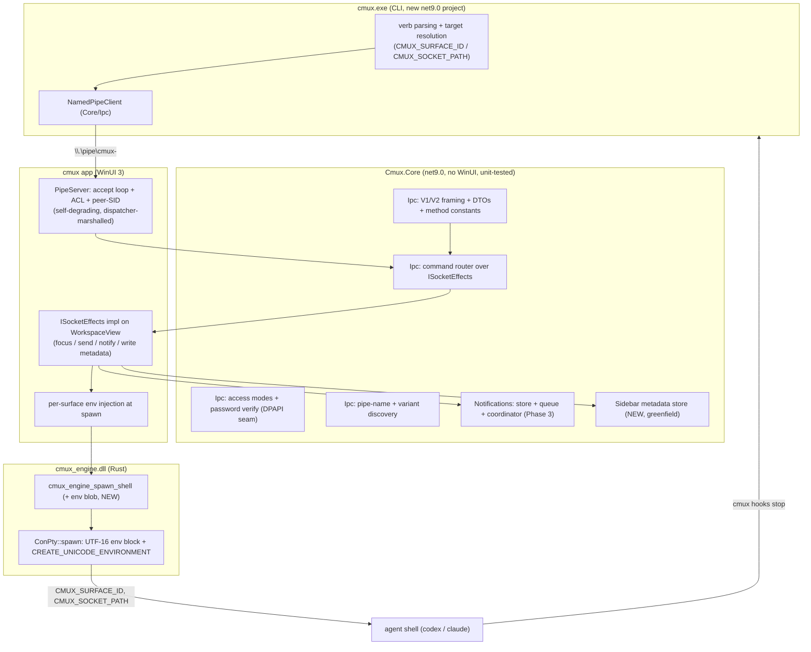

# feat: Phase 4 — CLI + IPC named-pipe socket

## Summary

Build the `cmux` CLI and the app-side named-pipe server that backs it, so that
programs running inside a pane — and the agent hooks they install — can talk to
the running app. This completes value-add #2 (notifications end-to-end, not just
OSC escape sequences) and plumbs the data Phase 5's sidebar will render.

The plan ports the macOS CLI + `TerminalController` socket dispatch to Windows:
a Windows named pipe (`\\.\pipe\cmux-<variant>`) carrying the dual wire protocol
(V1 space-separated text + V2 single-line JSON, both `\n`-framed) plus an
`events.stream` pub/sub channel. The shared wire contract, the command router,
the access-control logic, and a greenfield per-surface metadata store all live in
`Cmux.Core` (unit-tested, no WinUI); only live pipe I/O, peer-SID checks, and
app-state mutation touch the app plane.

The orchestration driver is **per-surface environment injection**: each pane's
shell is spawned with its own `CMUX_SURFACE_ID` / `CMUX_SOCKET_PATH`, so multiple
agents running concurrently in different panes each route their notifications and
status to their own surface. That requires the one Rust/FFI change in this phase
(the engine cannot inject per-surface env today). The agent-hook installer ships
working scripts for **claude** and **codex** with a reusable installer model; the
heavier external policy-hook pipeline (JSON patch/merge + trust authorization) is
an isolated, cuttable final unit.

This depends on merged Phase 1 + Phase 2 + Phase 3 on the default branch
`feat/phase1-walking-skeleton`.

---

## Problem Frame

Phase 3 made OSC notifications visible, but the headline use case — *an AI agent
finishing a task pulls your attention to the right pane* — only half works. An
agent that emits an OSC sequence is covered; an agent that fires a lifecycle hook
(the normal, reliable integration path for codex / claude) has nowhere to send
it, because there is no CLI and no socket. The whole reason the macOS app ships a
`cmux` CLI and a socket server is so agent hooks and shell integration can push
events *in* without going through the terminal byte stream.

There are three structural gaps today, all confirmed against the code:

1. There is no CLI binary and no `cli/` project (the only entry point is the
   WinUI app's `App.OnLaunched`), and no IPC code anywhere — `NamedPipeServerStream`,
   `PipeSecurity`, and DPAPI have zero usages in the Windows port.
2. Spawned shells cannot be told which surface they belong to.
   `cmux_engine_spawn_shell` takes only `cmdline` + `cwd`; ConPTY's
   `CreateProcessW` passes `lpEnvironment = NULL`, so every pane's shell inherits
   the app's process environment identically. Without a per-surface
   `CMUX_SURFACE_ID`, a hook fired from pane B cannot be distinguished from one
   fired in pane A — multi-agent orchestration is impossible.
3. There is no place for sidebar metadata (git branch, PR, cwd, status) to land.
   The model is strictly window → split-tree → panes → surfaces; no `Workspace`
   type, no git/PR/cwd fields exist. Phase 3 deferred socket notification
   actions, TTY→surface resolution, and the external policy-hook pipeline *to
   this phase*, and Phase 5's sidebar depends on the `report_*` commands this
   phase lands.

Phase 4 closes all three: a CLI + a secured named-pipe server speaking the ported
protocol, per-surface env injection so each agent is addressable, the socket
notification actions wired onto Phase 3's store, a greenfield metadata store fed
by `report_*`, and the agent-hook installer that makes "run an agent, get a
notification on its pane when it's done" work for claude and codex.

---

## Key Technical Decisions

- KTD1. **The wire contract lives in `Cmux.Core`; client and server share it.**
  The CLI is C# (.NET 9) specifically so the named-pipe client and the app-side
  server use the *same* V1/V2 framing, method-name constants, and JSON DTOs
  (a new `core/Ipc/` folder) — one source of truth, no protocol drift. The CLI is
  a new plain `net9.0` project that references `Cmux.Core`; it must **not** live
  under `app/` (that tree's `Directory.Build.props` carries the WinUI PRI
  task-assembly fix the CLI does not need). (R1, R2)

- KTD2. **Protocol ported verbatim; only the transport changes.** AF_UNIX → a
  Windows named pipe. The wire format is unchanged: newline-framed lines; a line
  beginning with `{` is V2 JSON (`{id, method, params}` → `{ok, id, result|error}`),
  everything else is V1 (`<verb> <rest>`, split once on space). `events.stream`
  keeps its `after_seq` cursor and `event`/`ack`/`heartbeat` frame shapes. Keeping
  the wire identical means the macOS hook scripts' command vocabulary carries over
  with only the socket path differing. (R2)

- KTD3. **The command router is pure `Cmux.Core` over an effects interface.** The
  server (app plane) owns the pipe stream and the accept loop; it hands each
  parsed line to a `Cmux.Core` router that maps method → handler. Handlers do not
  touch WinUI — they call an `ISocketEffects` interface the app implements (focus
  a surface, send text, mutate the notification store, write metadata). This keeps
  the entire dispatch table testable with a fake effects sink, exactly as Phase
  2/3 kept the split-tree and notification logic testable. All effects are
  marshalled onto `WorkspaceView`'s `DispatcherQueue` by the app implementation —
  Core stays single-threaded-UI per the Phase 3 KTD3 boundary. (R1, R2)

- KTD4. **Per-surface env injection is a Rust/FFI change — there is no other way.**
  Setting a var in the C# app process is process-global and racy across surfaces;
  the engine must set it per `CreateProcessW`. So `cmux_engine_spawn_shell` gains
  an env-blob parameter (`key=value` pairs, NUL-separated, UTF-8 `ptr+len`),
  regenerated through csbindgen; `ConPty::spawn` snapshots the current process
  environment, overlays the per-surface vars, encodes a double-NUL UTF-16 block,
  passes it as `lpEnvironment`, and ORs `CREATE_UNICODE_ENVIRONMENT` into the
  creation flags (currently only `EXTENDED_STARTUPINFO_PRESENT` — without the flag
  a UTF-16 block is misread). The app derives `CMUX_SURFACE_ID` from the surface's
  own id (no factory-signature widening needed) and injects `CMUX_SOCKET_PATH` /
  `CMUX_WORKSPACE_ID` globally. (R6)

- KTD5. **TTY resolution collapses to `CMUX_SURFACE_ID`.** macOS matched a
  caller's TTY name against a per-workspace `surfaceTTYNames` map to find the
  origin surface. Windows has no TTY device names, so the entire TTY machinery
  (`resolveCallerTTYName`, `surfaceTTYNames`, `report_tty`, `targetForTTY`) is
  dropped. `notification.create_for_caller` instead reads `preferred_surface_id`
  from the env var the CLI inherits. This is simpler and is the same mechanism
  that makes orchestration work. (R5, R6)

- KTD6. **Notification socket actions reuse the Phase 3 store/coordinator and the
  seams it left.** `dismiss`/`mark_read`/`list`/`clear` map directly onto
  `NotificationStore.ClearForSurface`/`Remove`/`MarkRead`/`Items`/`ClearAll`;
  `create`/`create_for_caller` enqueue through the coordinator with
  `coalesce: false` (the reserved CLI path — scripted notifications are never
  merged, unlike OSC bursts); hook-derived effects plug into the
  `NotificationPolicy(overrides:)` seam (U11). `open` reuses
  `WorkspaceView.FocusSurfaceById`. Only `jump_to_unread` is genuinely new logic,
  built atop `Store.Items` + `UnreadByPaneSurface`. (R5)

- KTD7. **Access control ports the full five-mode enum; the ACL is the real
  boundary.** macOS `SocketControlMode` has five values — `off`, `cmuxOnly`,
  `automation`, `password`, `allowAll` — not the three named while scoping. Porting
  all five is nearly free (it is one enum + a couple of predicates), so the plan
  ports them rather than inventing a Windows-only subset. The primary security
  boundary is the **pipe ACL restricted to the current-user SID** (the Windows
  analog of macOS's `0o600` + `cred.cr_uid == getuid()`); `allowAll` is the only
  mode that loosens it. `password` is the only mode requiring the DPAPI store.
  Peer verification (`GetNamedPipeClientProcessId` → token owner SID) is an
  additional check, not the primary gate. (R3)

- KTD8. **The password store is a DPAPI-protected file, not Credential Manager
  by default.** Source priority mirrors macOS: env `CMUX_SOCKET_PASSWORD` →
  a DPAPI-encrypted file under `%LOCALAPPDATA%\cmux\` (replacing the
  Keychain/file). Verification is constant-time. DPAPI is reached via the
  `System.Security.Cryptography.ProtectedData` NuGet package (not in the net9.0
  BCL). Windows Credential Manager is a viable alternative store but adds an
  interop surface for no functional gain over a DPAPI file scoped to the user. (R3)

- KTD9. **A greenfield per-surface metadata store in `Cmux.Core` keyed by
  `SurfaceId`.** Phase 5 has no model yet, so Phase 4 creates the minimal store
  the `report_*` commands write and the sidebar will later read. It is keyed by
  `SurfaceId` (a tab *is* a surface; the shell that reports runs in a surface and
  carries `CMUX_SURFACE_ID`). Phase 5 will aggregate per-workspace; Phase 4 keeps
  it per-surface and value-typed (no observables — the issue-#2586 discipline).
  Data shapes are ported from macOS (`GitBranchState{branch, isDirty}`,
  `PullRequestState{number, label, url, status: open|merged|closed, branch?,
  isStale}`, status/progress/log entries). (R7)

- KTD10. **`report_*` ships with a PowerShell shell-integration emitter; the heavy
  watchers stay minimal.** macOS emits `report_git_branch`/`report_pwd` from bash/zsh
  prompt hooks. Windows gets a PowerShell profile snippet (gated on
  `$env:CMUX_SURFACE_ID`) emitting `report_git_branch` + `report_pwd`, and `report_pr`
  when `gh` is available. The "watch git status" gate is honored via a
  `CMUX_NO_GIT_WATCH` env var. The less-essential `report_*` (ports, review,
  shell_state, pr_action) are deferred — they belong to features not built. (R7)

- KTD11. **Agent hooks: a reusable installer + claude/codex now; orchestration is
  the design center.** The installer writes a per-agent hook config that invokes
  `cmux hooks <agent> <subcommand>`, gated on `$env:CMUX_SURFACE_ID` so an
  unmanaged terminal no-ops. codex installs into `.codex/hooks.json` (nested
  format); claude is special-cased as a wrapper shim (`.cmd`/`.ps1`) that injects
  `--settings` hooks into the real `claude` rather than a config-file install,
  mirroring macOS's `Resources/bin/claude`. Each surface's distinct
  `CMUX_SURFACE_ID` is what lets N concurrent agents each surface to their own
  pane — the stop hook emits `notify_target_async <ws> <surface> <payload>`, never
  a global notification. Other agents (gemini, cursor, copilot, …) are a
  mechanical follow-up reusing the same installer. (R8)

- KTD12. **The external policy-hook pipeline is the isolated, cuttable final
  unit.** Mirroring how Phase 3 isolated the OS toast (its KTD8), the full
  hook-derived-effects pipeline (JSON envelope patch/merge, per-hook
  timeout/limits, trust authorization) is U11 and plugs into the Phase 3
  `NotificationPolicy(overrides:)` seam. Everything before it delivers value:
  hooks fire notifications through the direct path without it. If trust
  authorization proves heavy it slips to a follow-up without blocking the phase. (R9)

---

## High-Level Technical Design

### Component shape — three artifacts, one shared contract



Bold/NEW boxes are Phase 4 work; `Notifications` and the split-tree exist from
Phase 2/3.

### Orchestration flow — two agents, two panes, correct routing

This is the headline (AE2): each agent's stop hook lands on its own surface
because each shell carries a different `CMUX_SURFACE_ID`.

```mermaid
sequenceDiagram
    participant A as codex (pane A shell, CMUX_SURFACE_ID=S1)
    participant B as claude (pane B shell, CMUX_SURFACE_ID=S2)
    participant CLI as cmux CLI
    participant Srv as PipeServer (app)
    participant R as Router (Core)
    participant Co as NotificationCoordinator (Phase 3)
    participant UI as PaneView / Toast

    A->>CLI: cmux hooks codex stop  (stdin JSON; env S1)
    CLI->>Srv: V1 notify_target_async <ws> S1 "<title>|<sub>|<body>"
    Srv->>R: dispatch(line)
    R->>Co: OnNotification(S1, payload) [coalesce:false]
    Co-->>UI: surface S1 tab: unread + flash (+ toast if unfocused)

    B->>CLI: cmux hooks claude stop  (stdin JSON; env S2)
    CLI->>Srv: V1 notify_target_async <ws> S2 "<title>|<sub>|<body>"
    Srv->>R: dispatch(line)
    R->>Co: OnNotification(S2, payload) [coalesce:false]
    Co-->>UI: surface S2 tab: unread + flash
    Note over UI: S1 and S2 each light their own pane — never crossed
```

### Wire protocol (ported, transport-swapped)

| Layer | Shape | Detection / framing |
|---|---|---|
| Framing | one request/response per line, trailing `\n` | newline split on the stream |
| V1 | `<verb> <rest>` (split once on space); replies `OK: …` / `ERROR: …` | a line **not** starting with `{` |
| V2 | `{id, method, params}` → `{ok, id, result\|error{code,message}}` | a line starting with `{` |
| events.stream | V2 `method:"events.stream"`, params `after_seq`/`names`/`categories`/`include_heartbeats` | replies `ack` frame, then `event` frames, `heartbeat` on idle (15s) |

### Access-mode decision (server, per connection)

| Mode | Pipe ACL | Requires password | Notes |
|---|---|---|---|
| `off` | current-user SID only | no | socket present but commands rejected (parity) |
| `cmuxOnly` | current-user SID only | no | default; peer-SID check on |
| `automation` | current-user SID only | no | same ACL; reserved for automation clients |
| `password` | current-user SID only | **yes** | `auth` (V1) / `auth.login` (V2) before commands |
| `allowAll` | loosened (broad) | no | the only ACL-loosening mode |

---

## Output Structure

New IPC code clusters in a `core/Ipc/` folder and an `app/Ipc/` folder, mirroring
the Phase 3 `Notifications/` layout; the CLI is a new top-level project; the
shell-integration and hook templates live under a new `cli/templates/` (or
`build/`) tree.

```
core/
  Ipc/
    WireProtocol.cs           (U1) V1/V2 detect + line framing + escaping
    SocketRequest.cs          (U1) V1Command + V2Request/V2Response records
    EventFrame.cs             (U1) event / ack / heartbeat frame DTOs
    Methods.cs                (U1) method-name + V1-verb constants
    PipeName.cs               (U2) variant-aware pipe name + env precedence
    SocketDiscovery.cs        (U2) candidate ordering + connect-probe contract
    CommandRouter.cs          (U4) method -> handler over ISocketEffects
    ISocketEffects.cs         (U4) the app-implemented effect surface
    SocketAccess.cs           (U5) SocketControlMode enum + predicates
    PasswordStore.cs          (U5) source priority + constant-time verify (DPAPI seam)
  Sidebar/
    SurfaceMetadata.cs        (U7) git/PR/pwd/status/progress records
    SidebarMetadataStore.cs   (U7) per-SurfaceId store + indexes
app/
  Ipc/
    PipeServer.cs             (U3) accept loop + ACL + peer-SID + lifecycle
    PipeServerEffects.cs      (U4/U6/U7) ISocketEffects impl (marshals to UI)
    PeerIdentity.cs           (U5) GetNamedPipeClientProcessId + owner SID
  Splits/WorkspaceView.cs     (U6) expose focus/send/notify hooks to effects
  App.xaml.cs / MainWindow.xaml.cs (U3) start/stop the server
cli/
  Cmux.Cli.csproj             (U9) new net9.0 single-file project
  Program.cs                  (U9) verb dispatch
  PipeClientChannel.cs        (U9) connect + auth + request/response
  Hooks/                      (U10) installer + per-agent builders
  templates/
    claude.cmd / claude.ps1   (U10) claude wrapper shim
    cmux-shell-integration.ps1(U7)  report_* emitter (PowerShell profile)
engine/
  src/lib.rs                  (U8) spawn_shell + env param
  src/engine.rs               (U8) thread env through RenderCmd
  src/pty/conpty.rs           (U8) UTF-16 env block + CREATE_UNICODE_ENVIRONMENT
app/Interop/
  NativeMethods.g.cs          (U8) regenerated by csbindgen
  EngineHandle.cs             (U8) SpawnShell(env) overload
tests/
  Ipc/
    WireProtocolTests.cs      (U1)
    PipeNameTests.cs          (U2)
    CommandRouterTests.cs     (U4)
    SocketAccessTests.cs      (U5)
    PasswordStoreTests.cs     (U5)
  Ipc/NotificationActionTests.cs (U6)
  Sidebar/SidebarMetadataStoreTests.cs (U7)
```

The per-unit `**Files:**` lists are authoritative; this tree is the shape.

---

## Requirements

### CLI + transport

- R1. A `cmux` CLI binary talks to the running app over a Windows named pipe and
  exposes the verb set needed for value-add #2 and the sidebar: `send`/`send-key`,
  `notify`, notification verbs (`list-`/`dismiss-`/`mark-`/`open-`/`jump-to-unread`),
  `set-status`/`set-progress`/`log`, `sidebar-state`, and `hooks <agent> <sub>`.
- R2. The app hosts a named-pipe server speaking the dual wire protocol: V1
  (space-separated, newline-terminated) and V2 (single-line JSON request/response),
  plus an `events.stream` channel (`after_seq` cursor; `event`/`ack`/`heartbeat`
  frames). A leading `{` selects V2.
- R4. Pipe name resolution honors env precedence (`CMUX_SOCKET_PATH` → `CMUX_SOCKET`)
  and variant-aware discovery (`stable`/`nightly`/`staging`/`dev` + optional slug)
  with connect-probing to prefer a live server.

### Security

- R3. Pipe access is secured: the ACL is restricted to the current-user SID; the
  connecting peer's process owner is verified; five access modes
  (`off`/`cmuxOnly`/`automation`/`password`/`allowAll`) are supported, with
  `password` backed by a DPAPI-protected store and constant-time verification, and
  `allowAll` the only mode that loosens the ACL.

### Notifications complete (value-add #2)

- R5. Notifications work end-to-end over the socket: `cmux notify` (and agent
  hooks) raise a notification routed to the correct surface via `CMUX_SURFACE_ID`
  (replacing macOS TTY resolution); the socket notification actions
  (`create`/`create_for_caller`/`dismiss`/`mark_read`/`open`/`jump_to_unread`/
  `list`/`clear`) drive the Phase 3 store/coordinator; scripted notifications
  bypass coalescing (`coalesce:false`).
- R6. Each managed surface's shell is spawned with per-surface environment
  (`CMUX_SURFACE_ID`, `CMUX_SOCKET_PATH`, `CMUX_WORKSPACE_ID`), so multiple
  concurrently-running agents each route notifications/status to their own surface.

### Sidebar plumbing (for Phase 5)

- R7. `report_git_branch`/`report_pr`/`report_pwd` (+ `set_status`/`set_progress`/
  `log`) update a per-surface metadata store in `Cmux.Core` (value-typed, no
  observables); a PowerShell shell-integration snippet emits the git/pwd reports,
  gated on `CMUX_SURFACE_ID` and a git-watch toggle.

### Agent hooks (orchestration)

- R8. An agent-hook installer registers per-agent hooks for **claude** and
  **codex** whose lifecycle events (`session-start`/`prompt-submit`/`stop`/
  `notification`/`session-end`/`session-finalize`) call `cmux hooks <agent> <sub>`,
  gated on `CMUX_SURFACE_ID`; the stop hook raises a notification attributed to
  the agent's own surface.
- R9. (cuttable) An external policy-hook pipeline applies hook-derived effect
  overrides (JSON envelope patch/merge + per-hook timeout/limits + trust
  authorization) through the Phase 3 `NotificationPolicy` override seam.

### Acceptance Examples

- AE1. From inside a pane (`CMUX_SURFACE_ID` set), `cmux notify --title X --body Y`
  raises a notification on that surface — unread badge + pane flash, and a toast
  if the surface is not in front. (R1, R5)
- AE2. Two agents running in two panes each fire a stop hook → each notification
  lands on its own surface's tab, never the other's. (R6, R8)
- AE3. `cmux mark-notification-read --id <id>`, `dismiss-notification --id <id>`,
  and `jump-to-unread` each mutate the Phase 3 store and the UI reflects it. (R5)
- AE4. A client whose process owner is not the current user is rejected; in
  `password` mode a client is rejected until it sends the correct `auth`/`auth.login`,
  then accepted. (R3)
- AE5. With a `stable` app and a `nightly` variant both running, the CLI connects
  to the intended pipe via env/variant resolution + connect-probing. (R4)
- AE6. In a pane, `cd` into a git working tree → the metadata store records the
  branch + dirty flag (via the PowerShell `report_git_branch`), ready for Phase 5;
  with git-watch disabled, nothing is reported. (R7)
- AE7. `cmux hooks install codex` (and `claude`) writes the hook config/shim gated
  on `CMUX_SURFACE_ID`; running the agent and finishing a turn raises a "completed"
  notification on its surface. (R8)
- AE8. Rapid scripted `cmux notify` calls are each delivered (not coalesced),
  unlike an OSC burst. (R5)

---

## Implementation Units

Sequence: **(U1 ∥ U2 ∥ U8) → U4 → U3 → U5 → (U6 ∥ U7) → U9 → U10 → U11.**
U1/U2 (Core wire + discovery) and U8 (Rust env injection) are independent and can
start immediately. U4 (router) needs U1; U3 (server) needs U4; U5 (auth) needs
U3. U6/U7 (notification actions, metadata) need the router and run in parallel.
U9 (CLI) needs U1/U2 and is exercised end-to-end once U3 is up. U10 (hooks) needs
U8 + U9 + U6. U11 (policy pipeline) is the isolated cuttable last unit.

Sub-phases for clarity: **4a** = U1–U5 (socket backbone) · **4b** = U6–U8
(notifications complete + orchestration keystone) · **4c** = U9–U11 (CLI + hooks).

### U1. IPC wire contract + framing (Core)

- Goal: A shared, transport-agnostic V1/V2 protocol library both the server and
  the CLI use — the single source of truth for framing, request/response DTOs,
  event frames, method/verb names, and `send`-text escaping.
- Requirements: R1, R2.
- Dependencies: none.
- Files:
  - `core/Ipc/WireProtocol.cs` (create — `IsV2(line)` = leading `{`; split-V1
    `(verb, rest)` on first space; line framing read/write helpers;
    `UnescapeSendText`/`EscapeSendText`)
  - `core/Ipc/SocketRequest.cs` (create — `V1Command(string Verb, string Rest)`;
    `V2Request(string? Id, string Method, JsonElement? Params)`;
    `V2Response` with `Ok`/`Id`/`Result`/`Error{Code,Message}` and `v2Ok`/`v2Err`
    factories)
  - `core/Ipc/EventFrame.cs` (create — `event`/`ack`/`heartbeat` frame records +
    their JSON field shapes: `seq`, `name`, `category`, `payload`, etc.)
  - `core/Ipc/Methods.cs` (create — string constants for V2 methods used this
    phase: `system.ping/capabilities/tree`, `surface.send_text/send_key/list/
    current/focus`, `notification.*`, `auth.login/status`, `events.stream`; and
    V1 verbs: `notify`/`notify_target`/`notify_target_async`/`auth`/`report_*`/
    `set_status`/`set_progress`/`log`/`sidebar_state`/`list_notifications`/
    `clear_notifications`)
  - `tests/Ipc/WireProtocolTests.cs` (create)
- Approach: Pure records + static helpers; `System.Text.Json` with a
  source-generated `JsonSerializerContext` so the CLI can publish AOT/trim-safe.
  Error codes match macOS (`invalid_utf8`/`parse_error`/`invalid_request`/
  `method_not_found`). Keep DTOs UI-free (only `SurfaceId`/`PaneId` from
  `core/Splits/Ids.cs` and primitives). Do not implement transport here — that is
  U3 (server) / U9 (client).
- Patterns to follow: the `readonly record struct` style of `core/Splits/Ids.cs`
  and `core/Notifications/SurfaceNotification.cs`; one type per file.
- Execution note: test-first — the framing/detect/escape rules are pure and
  edge-case-rich.
- Test scenarios:
  - A line starting with `{` → `IsV2` true; a `notify …` line → false. Covers R2.
  - V1 split: `notify_target ws surf a|b|c` → verb `notify_target`, rest
    `ws surf a|b|c` (split once only).
  - V2 round-trip: serialize a `V2Request`, parse it back, fields intact;
    malformed JSON → `parse_error`; missing `method` → `invalid_request`;
    unknown method is **not** rejected here (router's job).
  - `UnescapeSendText` handles the macOS escape set (e.g. `\n`, `\t`, `\\`);
    round-trips with `EscapeSendText`.
  - `v2Ok`/`v2Err` produce `{ok:true,id,result}` / `{ok:false,id,error{code,message}}`.
  - An `event` frame serializes with `type:"event"`, `seq`, `name`, `payload`;
    `ack` carries `replay_count` + `resume`; `heartbeat` carries `latest_seq`.
- Verification: `dotnet test tests/Cmux.Core.Tests.csproj` green for the new
  `tests/Ipc/` classes.

### U2. Pipe-name resolution + variant discovery (Core)

- Goal: Resolve which named pipe to connect to / serve on, honoring env
  precedence and variant/slug naming, with a connect-probe contract that prefers
  a live server.
- Requirements: R4.
- Dependencies: none.
- Files:
  - `core/Ipc/PipeName.cs` (create — `Resolve(env)` precedence
    `CMUX_SOCKET_PATH` → `CMUX_SOCKET`; `ForVariant(variant, slug?)` →
    `cmux[-variant][-slug]`; slug sanitized to `[A-Za-z0-9-_]`; the bare local
    pipe name vs the full `\\.\pipe\…` form)
  - `core/Ipc/SocketDiscovery.cs` (create — candidate ordering: explicit env →
    default → variant probes; takes a `Func<string,bool> canConnect` probe so the
    ordering logic is pure and testable; the actual `WaitNamedPipe`/`CreateFile`
    probe is supplied by the app/CLI)
  - `tests/Ipc/PipeNameTests.cs` (create)
- Approach: macOS `SocketPathVariant` → Windows pipe names. The Windows pipe
  namespace is per-machine (`\\.\pipe\`), so per-user isolation comes from the
  ACL (U5), not the path; keep an owner-style preference in discovery for the
  case of multiple users (probe + prefer the pipe whose server is the current
  user — deferred refinement, noted). Variants: `stable` → `cmux`;
  `nightly`/`staging`/`dev` → `cmux-<variant>[-<slug>]`.
- Patterns to follow: `core/Splits/Ids.cs` value-type style; inject probes as
  delegates (the Phase 3 `Func<SurfaceId,bool> isLive` pattern in
  `NotificationQueue.Drain`).
- Execution note: test-first.
- Test scenarios:
  - Both env vars set and equal → that path; both set and different → error
    (parity with macOS "refusing to choose").
  - `CMUX_SOCKET_PATH` only / `CMUX_SOCKET` only / neither (→ default `cmux`).
  - `ForVariant("nightly","my/slug!")` → `cmux-nightly-myslug` (sanitized).
  - Discovery ordering: with a fake `canConnect` returning true only for the
    second candidate, that one is selected. Covers AE5.
  - No live candidate → returns the default (server-create case) / null
    (client-connect case), per the documented contract.
- Verification: `dotnet test tests/Cmux.Core.Tests.csproj` green.

### U3. Named-pipe server + lifecycle (app)

- Goal: Accept connections on the pipe, frame lines, hand each to the Core
  router, write framed responses — as a self-degrading, dispatcher-marshalling
  background service owned by the app.
- Requirements: R1, R2.
- Dependencies: U4 (router), U1 (framing). (U5 layers auth on top.)
- Files:
  - `app/Ipc/PipeServer.cs` (create — `NamedPipeServerStreamAcl.Create` with a
    `PipeSecurity` granting only the current-user SID; an async accept loop
    re-arming a new server instance per connection; per-connection read→dispatch
    →write; `events.stream` long-lived branch; `Start()`/`Stop()` symmetric)
  - `app/App.xaml.cs` (modify — construct + `Start()` the server after the window
    is up; the app singleton is the lifecycle owner)
  - `app/MainWindow.xaml.cs` (modify — `this.Closed` → `PipeServer.Stop()`,
    alongside the existing `Workspace.ShutdownAll()`)
- Approach: Model the register/degrade/marshal shape on `app/Splits/ToastService.cs`
  — wrap `Start()` in try/catch so a pipe failure logs via `App.LogError` and
  leaves the app fully functional (the CLI simply can't connect), never crashes.
  The read loop runs off the UI thread; every effect the router triggers is
  marshalled onto `WorkspaceView`'s `DispatcherQueue` by the effects impl (U4),
  honoring the Phase 3 single-threaded-UI rule. Multiple concurrent client
  connections are supported (one `NamedPipeServerStream` per client; cap the
  in-flight count). Allow N instances via `maxNumberOfServerInstances`.
- Patterns to follow: `ToastService` (guarded register, self-degrade, `App.LogError`,
  `DispatcherQueue.TryEnqueue` marshalling); the `MainWindow` inbound-wiring for
  `Activated`/`Closed` as the lifecycle model.
- Execution note: app-side I/O — no Core test project; verified by build + the
  manual e2e once U9 lands. The dispatch logic it drives is covered in U4.
- Test scenarios:
  - Test expectation: none automated (app-side socket I/O). Verified by build +
    manual: a client connects, sends `system.ping`, gets a framed reply; closing
    the app stops the server cleanly (no orphaned pipe). The framing/dispatch it
    relies on is covered by U1/U4 Core tests.
- Verification: `dotnet build app/Cmux.App.csproj -c Debug -p:SkipCmuxEngineBuild=true`
  clean; manual: `cmux ping`-equivalent round-trips after U9.

### U4. Command router over `ISocketEffects` (Core)

- Goal: Map every supported V1 verb / V2 method to a handler that calls an
  app-implemented effects interface, so the entire dispatch table is unit-tested
  without a pipe or a window.
- Requirements: R1, R2.
- Dependencies: U1.
- Files:
  - `core/Ipc/ISocketEffects.cs` (create — the effect surface: `FocusSurface`,
    `SendText`, `SendKey`, notification actions (delegated to U6), metadata
    writes (delegated to U7), `Tree()` snapshot read, `Ping`/`Capabilities`)
  - `core/Ipc/CommandRouter.cs` (create — `Dispatch(string line, ISocketEffects,
    AuthState) → string response`; V1/V2 branch via `WireProtocol`; method table;
    `method_not_found` for unknown V2; `ERROR:` for unknown V1; an `events.stream`
    marker the server consumes)
  - `tests/Ipc/CommandRouterTests.cs` (create)
- Approach: The router is the pure heart. It parses with U1, looks up the handler,
  validates params, and invokes `ISocketEffects`. Unknown methods return the
  correct error shape. Auth gating is a parameter (the router refuses
  non-`auth` commands when `AuthState.Required && !Authenticated`) so U5 can layer
  password mode without reshaping handlers. `events.stream` is not handled inline
  — the router signals the server to switch that connection to the stream pump.
- Patterns to follow: the Phase 3 pure-method-with-injected-callbacks design
  (`NotificationQueue.Drain(probe, deliver)`); a fake effects sink mirrors the
  `FakeSurface`/`FakeFactory` test pattern in `tests/Splits/SurfaceManagerTests.cs`.
- Execution note: test-first — this is the dispatch contract; high bug-leverage.
- Test scenarios:
  - `system.ping` → `{ok:true,…}`; unknown V2 method → `method_not_found`.
  - V1 `notify_target ws surf a|b|c` → effects `CreateNotificationForTarget`
    called with parsed `(surface, title, subtitle, body)`. Covers R5 mapping.
  - `surface.send_text {surface_id, text}` → `SendText(surface, unescaped)`.
  - Unknown V1 verb → `ERROR: …`; malformed V2 → `parse_error`.
  - Auth gating: with `Required && !Authenticated`, a non-`auth` command is
    refused; after `auth`/`auth.login`, the same command dispatches. Covers AE4.
  - `events.stream` request returns the stream-switch signal, not an inline reply.
- Verification: `dotnet test tests/Cmux.Core.Tests.csproj` green.

### U5. Access modes + peer identity + DPAPI password (Core + app)

- Goal: Enforce the five access modes, the current-user-SID ACL, peer-process
  ownership, and `password`-mode authentication with a DPAPI-backed store.
- Requirements: R3.
- Dependencies: U3, U4, U1.
- Files:
  - `core/Ipc/SocketAccess.cs` (create — `enum SocketControlMode { Off, CmuxOnly,
    Automation, Password, AllowAll }`; predicates `RequiresPasswordAuth` (only
    `Password`), `LoosensAcl` (only `AllowAll`), `CommandsEnabled` (false for
    `Off`))
  - `core/Ipc/PasswordStore.cs` (create — source priority env
    `CMUX_SOCKET_PASSWORD` → DPAPI file; `Verify(candidate)` constant-time; the
    DPAPI protect/unprotect behind an `ISecretProtector` seam so Core stays
    testable and the app supplies the real `ProtectedData` impl)
  - `app/Ipc/PeerIdentity.cs` (create — P/Invoke `GetNamedPipeClientProcessId`;
    open the process, get its token, compare owner SID to the current user's;
    `bool IsSameUserPeer(SafePipeHandle)`)
  - `app/Ipc/PipeServer.cs` (modify — set the `PipeSecurity` per `LoosensAcl`;
    run the peer check on connect; gate command dispatch on auth state)
  - `tests/Ipc/SocketAccessTests.cs`, `tests/Ipc/PasswordStoreTests.cs` (create)
- Approach: The ACL is the real boundary — `NamedPipeServerStreamAcl.Create` with
  a `PipeSecurity` allowing only the current-user SID (full control) for every
  mode except `AllowAll` (which grants a broader SID). The peer-SID check is
  defense-in-depth. `password` mode: the router refuses commands until a valid
  `auth`/`auth.login`; verification is constant-time over the stored secret. The
  DPAPI file lives under `%LOCALAPPDATA%\cmux\socket-control-password` encrypted
  with `DataProtectionScope.CurrentUser`; the `ISecretProtector` seam lets Core
  tests use an in-memory protector.
- Patterns to follow: macOS `SocketControlMode` + `SocketControlPasswordStore`
  (source priority, constant-time verify); the Phase 3 delegate-seam style for
  `ISecretProtector`.
- Execution note: test-first for the mode predicates + password verify; the SID
  P/Invoke is app-side, verified manually.
- Test scenarios:
  - Predicates: only `Password` requires auth; only `AllowAll` loosens; `Off`
    disables commands.
  - `PasswordStore`: env var wins over file; absent everywhere → no password
    required path; `Verify` true only for the exact secret; constant-time
    (structural — compares full length).
  - Round-trip through a fake `ISecretProtector` (protect → unprotect → equal).
  - Peer identity: test expectation none automated (app-side P/Invoke); verified
    manually that a same-user client passes and the ACL blocks others. Covers AE4.
- Verification: `dotnet test tests/Cmux.Core.Tests.csproj` green; manual: connect
  under `password` mode, confirm reject-then-accept.

### U6. Notification socket actions → Phase 3 coordinator (Core + app)

- Goal: Wire the socket notification actions onto the existing Phase 3 store and
  coordinator, including the `CMUX_SURFACE_ID`-based caller resolution and the new
  `jump_to_unread`/`open` logic.
- Requirements: R5.
- Dependencies: U4 (router), Phase 3 `NotificationStore`/`NotificationCoordinator`.
- Files:
  - `core/Ipc/ISocketEffects.cs` (modify — add the notification-action methods:
    `CreateNotification(surface, payload)`, `CreateForCaller(preferredSurface?,
    payload)`, `DismissNotification(id|allRead)`, `MarkRead(id|surface|all)`,
    `OpenNotification(id)`, `JumpToUnread()`, `ListNotifications()`, `ClearAll()`)
  - `core/Notifications/NotificationCoordinator.cs` (modify — add a
    `JumpToUnreadTarget()` helper returning the latest-unread `(PaneId,SurfaceId)`
    from `UnreadByPaneSurface`/`Store.Items`; add `MarkRead(Guid)` / `Remove(Guid)`
    pass-throughs if not already exposed)
  - `app/Ipc/PipeServerEffects.cs` (create or extend — implement the notification
    methods by marshalling to `WorkspaceView`: enqueue with `coalesce:false`,
    drive `FocusSurfaceById` for `open`/`jump_to_unread`, mutate `Store`)
  - `app/Splits/WorkspaceView.cs` (modify — expose the coordinator hooks the
    effects impl needs: a scripted-notify entry that enqueues `coalesce:false`,
    and a focus-by-surface that already exists as `FocusSurfaceById`)
  - `tests/Ipc/NotificationActionTests.cs` (create)
- Approach: The CLI path enqueues with `coalesce:false` (KTD6) so scripted
  notifications are never merged (AE8). `create_for_caller` resolves the target
  from `preferred_surface_id` (the env var the CLI carries) — branch 2/4 of the
  macOS resolver; the TTY branch is dead (KTD5). `dismiss`/`mark_read`/`list`/
  `clear` are thin maps onto `NotificationStore`. `open` focuses via
  `FocusSurfaceById`. `jump_to_unread` picks the newest unread surface and focuses
  it. The Core-testable slice is the action→store-mutation mapping (against a real
  `NotificationStore` + fake snapshot); the marshalling is app-side.
- Patterns to follow: the Phase 3 `NotificationCoordinator` surface and
  `WorkspaceView.FocusSurfaceById`; `coalesce:false` per the queue's documented
  Phase 4 path; `tests/Notifications/NotificationCoordinatorTests.cs` snapshot
  fixtures.
- Execution note: test-first for the action→mutation mapping.
- Test scenarios:
  - `create` for an unfocused surface → store records unread; `coalesce:false` so
    two rapid creates record/deliver twice. Covers AE8, R5.
  - `mark_read(id)` / `dismiss(id)` / `dismiss(all_read)` mutate exactly the
    intended scope. Covers AE3.
  - `create_for_caller` with `preferred_surface_id=S` → targets S; with an absent
    surface → falls back to the focused surface.
  - `jump_to_unread` with two unread surfaces → returns the newest; with none →
    no-op. Covers AE3.
  - `list` returns the store items newest-first.
- Verification: `dotnet test tests/Cmux.Core.Tests.csproj` green; manual AE1/AE3
  once the CLI (U9) lands.

### U7. Sidebar metadata store + `report_*` + PowerShell shell-integration

- Goal: A greenfield per-surface metadata store the `report_*`/`set_*`/`log`
  commands write, plus the PowerShell snippet that emits the git/pwd reports —
  the data Phase 5's sidebar will render.
- Requirements: R7.
- Dependencies: U4 (router).
- Files:
  - `core/Sidebar/SurfaceMetadata.cs` (create — `GitBranchState(string Branch,
    bool IsDirty)`; `enum PullRequestStatus { Open, Merged, Closed }`;
    `PullRequestState(int Number, string Label, string Url, PullRequestStatus
    Status, string? Branch, bool IsStale)`; `StatusEntry`/`ProgressEntry`/`LogEntry`)
  - `core/Sidebar/SidebarMetadataStore.cs` (create — keyed by `SurfaceId`;
    `ReportGitBranch`/`ClearGitBranch`, `ReportPullRequest`/`ClearPullRequest`,
    `ReportPwd`, `SetStatus`/`ClearStatus`, `SetProgress`/`ClearProgress`, `Log`;
    read indexes for Phase 5; value-typed snapshots, no observables — issue-#2586)
  - `core/Ipc/ISocketEffects.cs` (modify — add the `report_*`/`set_*`/`log`
    methods; the router parses flags `--status=`, `--state=`, `--branch=`,
    `--label=`, `--icon=`, `--color=#`, `--url=`, `--priority=`, `--format=`)
  - `app/Ipc/PipeServerEffects.cs` (modify — implement by writing the store on the
    UI thread; honor the `CMUX_NO_GIT_WATCH`/`CMUX_NO_PR_WATCH` gates)
  - `cli/templates/cmux-shell-integration.ps1` (create — a PowerShell profile
    snippet that, gated on `$env:CMUX_SURFACE_ID` and not `$env:CMUX_NO_GIT_WATCH`,
    runs on prompt and emits `cmux report_git_branch`/`report_pwd`, and
    `report_pr` when `gh` is present)
  - `tests/Sidebar/SidebarMetadataStoreTests.cs` (create)
- Approach: Port the macOS data shapes (`SidebarGitBranchState`,
  `SidebarPullRequestStatus`, `SidebarPullRequestState{…isStale}`). Key by
  `SurfaceId` (KTD9). The store is pure and value-typed so Phase 5 can read
  snapshots without re-introducing the CPU-spin observable hazard. The PowerShell
  snippet mirrors the macOS bash/zsh integration: a `prompt` hook that diffs cheap
  state and reports only on change; gated so an unmanaged terminal is silent. The
  PR label defaults to "PR" (max 16 chars); status maps `open`/`merged`/`closed`.
- Patterns to follow: `NotificationStore` (single owner + derived indexes +
  reindex-on-mutation); the value-type discipline of `TabHeaderDto`; macOS
  `reportGitBranch`/`reportPullRequest` flag handling.
- Execution note: test-first for the store + flag parsing.
- Test scenarios:
  - `ReportGitBranch("main", dirty:true)` for surface S → store reflects it;
    `ClearGitBranch` removes it; git-watch-off path clears instead of sets. Covers AE6, R7.
  - `ReportPullRequest` with `--state=merged` → `Status==Merged`; label clamped to
    16 chars; invalid url rejected.
  - `ReportPwd` updates the cwd; `SetStatus`/`SetProgress`/`Log` populate their
    entries; `--priority`/`--color`/`--format` parsed.
  - Two surfaces report independently → no cross-talk (per-`SurfaceId` keying).
  - PowerShell snippet: test expectation none automated (script); verified
    manually per AE6 (cd into a repo, confirm the store records the branch).
- Verification: `dotnet test tests/Cmux.Core.Tests.csproj` green; manual AE6.

### U8. Per-surface environment injection (Rust FFI + ConPTY + app)

- Goal: Spawn each managed surface's shell with its own `CMUX_SURFACE_ID` /
  `CMUX_SOCKET_PATH` / `CMUX_WORKSPACE_ID`, the keystone that makes multiple
  concurrent agents individually addressable.
- Requirements: R6.
- Dependencies: none (independent Rust/FFI work; required before U10 e2e).
- Files:
  - `engine/src/lib.rs` (modify — extend `cmux_engine_spawn_shell` with
    `env_utf8: *const u8, env_len: usize`: a `key=value` blob, entries
    NUL-separated, UTF-8; `catch_unwind` boundary preserved)
  - `engine/src/engine.rs` (modify — thread the env pairs through
    `Engine::spawn_shell` → `RenderCmd::SpawnShell` → `RenderState::spawn_shell`)
  - `engine/src/pty/conpty.rs` (modify — in `ConPty::spawn`, snapshot
    `std::env::vars()`, overlay the per-surface pairs, encode a double-NUL-
    terminated UTF-16 block, pass it as `lpEnvironment`, and OR
    `CREATE_UNICODE_ENVIRONMENT` into the creation flags)
  - `app/Interop/NativeMethods.g.cs` (regenerate via csbindgen — diff-checked in)
  - `app/Interop/EngineHandle.cs` (modify — `SpawnShell(string cmdline, string?
    cwd, IReadOnlyDictionary<string,string>? env)`; marshal the blob)
  - `app/Controls/TerminalPane.xaml.cs` (modify — build the env from the pane's
    own `SurfaceId` + the global socket path; pass to `SpawnShell`)
  - `app/Splits/WorkspaceView.cs` (modify — supply the global `CMUX_SOCKET_PATH` /
    `CMUX_WORKSPACE_ID` the pane needs)
  - `engine/src/pty/conpty.rs` (test — `#[cfg(test)]` for the env-block encoder)
- Approach: A `key=value` NUL-separated blob avoids ambiguity (values may contain
  `=`; keys won't contain NUL). The encoder is the only pure-testable Rust slice
  (Phase 3's U1 precedent for engine tests). The app derives `CMUX_SURFACE_ID`
  locally from `TerminalPane`'s known `SurfaceId` (no `ISurfaceFactory` signature
  change needed); `CMUX_SOCKET_PATH` is the global pipe path; `CMUX_WORKSPACE_ID`
  is the single implicit workspace for now (Phase 5 makes it real). Rebuilding the
  DLL needs cargo (not on PATH — use `C:\Users\steve\.cargo\bin\cargo.exe` via
  Start-Process + timeout per the cargo-not-on-path memory); after the cargo build,
  the app build with `-p:SkipCmuxEngineBuild=true` still stages the fresh DLL
  (`PreserveNewest`).
- Patterns to follow: the existing `ConPty::spawn` `CreateProcessW` call and
  `STARTUPINFOEXW` setup in `engine/src/pty/conpty.rs`; the FFI string-marshalling
  (`ptr+len` UTF-8) used by `cmux_engine_spawn_shell` today; the Phase 3 U1
  engine-test pattern.
- Execution note: test-first for the env-block encoder (Rust); the FFI/app wiring
  verified by build + manual (AE2).
- Test scenarios (Rust `#[cfg(test)]`):
  - Encode `[("CMUX_SURFACE_ID","S1"),("A","b=c")]` → a double-NUL UTF-16 block
    with both entries; `b=c` value preserved.
  - Empty env → inherits parent (block is the parent snapshot, no overlay).
  - Overlay replaces an existing key rather than duplicating it.
  - Parse the FFI blob: NUL-separated `key=value` round-trips; a malformed entry
    (no `=`) is skipped, no panic.
- Verification: `cargo test` in `engine/` green for the encoder; DLL rebuilds;
  `dotnet build app/Cmux.App.csproj -c Debug -p:SkipCmuxEngineBuild=true` clean;
  manual: open two panes, `echo $env:CMUX_SURFACE_ID` differs per pane.

### U9. The `cmux` CLI binary (new project)

- Goal: A standalone `cmux.exe` CLI that connects to the pipe and exposes the verb
  set, resolving its target from the env it inherits.
- Requirements: R1.
- Dependencies: U1, U2 (wire + discovery); exercised e2e once U3 is up.
- Files:
  - `cli/Cmux.Cli.csproj` (create — plain `net9.0`, `OutputType=Exe`,
    `AssemblyName=cmux`, `PublishSingleFile=true`, self-contained `win-x64`,
    `InvariantGlobalization`; references `..\core\Cmux.Core.csproj`; **outside
    `app/`** so it does not inherit the WinUI PRI props)
  - `cli/Program.cs` (create — verb dispatch: `send`/`send-key`, `notify`,
    `list-`/`dismiss-`/`mark-`/`open-notification`, `jump-to-unread`,
    `clear-notifications`, `set-status`/`set-progress`/`log`, `sidebar-state`,
    `hooks <agent> <sub>`; `--socket` override)
  - `cli/PipeClientChannel.cs` (create — resolve pipe via U2, `NamedPipeClientStream`
    connect with timeout, optional `auth` handshake, one-line request → one-line
    response; `events.stream` long-read mode)
  - `cli/TargetResolution.cs` (create — explicit `--workspace`/`--surface`/`--window`
    → else env `CMUX_WORKSPACE_ID`/`CMUX_SURFACE_ID`)
  - `tests/Ipc/CliArgsTests.cs` (create — the pure arg-parse/escape slices)
- Approach: The CLI is a thin client over `Cmux.Core` `Ipc` types — no protocol
  logic of its own. `notify` implements the three-way routing (KTD5): explicit
  ws+surface → V1 `notify_target`; surface/window only → V2 `notification.create`;
  neither → V2 `notification.create_for_caller` with `preferred_surface_id` from
  the env var. Client auth sends `auth <password>` when a password resolves
  (env/store). Keep parsing in small pure helpers so the escaping + routing are
  Core-testable even though the I/O isn't.
- Patterns to follow: U1 wire DTOs; macOS `cmux.swift` verb→method mapping and
  `notify` routing; the env-precedence resolver from U2.
- Execution note: test-first for arg parsing / `notify` routing selection; the
  socket round-trip is manual e2e.
- Test scenarios:
  - `notify --title T --body B` with `CMUX_SURFACE_ID` set, no explicit target →
    selects `create_for_caller` with `preferred_surface_id`. Covers AE1.
  - `notify --workspace W --surface S` → selects `notify_target`.
  - `send "a\nb"` → `surface.send_text` with the escape resolved.
  - Unknown verb → non-zero exit + usage.
  - `--socket <path>` overrides discovery.
- Verification: `dotnet build cli/Cmux.Cli.csproj -c Debug` clean;
  `dotnet test tests/Cmux.Core.Tests.csproj` green; manual: `cmux notify …` from a
  pane raises AE1; `mark/dismiss/jump` drive AE3.

### U10. Agent-hook installer + claude/codex (multi-agent orchestration)

- Goal: Install per-agent hooks for claude and codex so finishing a turn raises a
  notification on the agent's own surface, with a reusable installer for the rest.
- Requirements: R8.
- Dependencies: U8 (env routing), U9 (the CLI + `hooks` verb), U6 (notification
  actions).
- Files:
  - `cli/Hooks/HookInstaller.cs` (create — `install`/`uninstall <agent>`; read,
    prune cmux-owned entries by marker, merge, write; `--yes` to skip confirm)
  - `cli/Hooks/AgentHookDefs.cs` (create — the `AgentHookDef` shape +
    definitions for `codex` (`.codex/hooks.json`, nested format, events
    SessionStart/UserPromptSubmit/Stop) and `claude` (wrapper-shim install))
  - `cli/Hooks/GenericHookRunner.cs` (create — `hooks <agent> <sub>`: read stdin
    JSON, resolve workspace/surface from env, map subcommand → action, emit V1
    `notify_target_async <ws> <surface> <payload>` on `.stop`, `set_status` on
    lifecycle)
  - `cli/templates/claude.cmd`, `cli/templates/claude.ps1` (create — the claude
    wrapper that injects `--settings <hooks-json>` + `--session-id` into the real
    `claude` when `CMUX_SURFACE_ID` is set and the socket is live; pass-through
    otherwise)
  - `cli/Program.cs` (modify — route `hooks` to setup/install/uninstall or the
    generic/claude runner)
- Approach: The hook shell snippet is gated on `$env:CMUX_SURFACE_ID` so an
  unmanaged terminal no-ops with `{}` — and that env var (from U8) is exactly what
  makes N concurrent agents each surface to their own pane (AE2). codex gets a
  `.codex/hooks.json` merge (nested `{"hooks":[{"type":"command","command":…,
  "timeout":…}]}`); claude is special-cased as a `.cmd`/`.ps1` wrapper shim
  (config-file install isn't how claude hooks work), mirroring macOS
  `Resources/bin/claude`. Lifecycle subcommands map: `stop`→notification,
  `session-start`/`prompt-submit`/`session-end`/`session-finalize`→status/lifecycle.
  The `.stop` payload is `<displayName>|<subtitle>|<body>` pipe-delimited (parsed
  app-side). Other agents reuse `HookInstaller` + a new `AgentHookDef` (follow-up).
- Patterns to follow: macOS `CMUXCLI+AgentHookDefinitions.swift` (the `AgentHookDef`
  struct, `buildHooksDict` per-format, the gated shell template) and
  `Resources/bin/claude` (the wrapper shim); the `runGenericAgentHook` `.stop`
  branch emitting `notify_target_async`.
- Execution note: the installer's JSON merge/prune is Core-testable; the agent
  e2e is manual.
- Test scenarios:
  - Installer merge: writing codex hooks into an existing `.codex/hooks.json`
    preserves non-cmux entries and prunes stale cmux entries by marker
    (test the pure merge function with a fixture JSON).
  - The generated snippet contains the `$env:CMUX_SURFACE_ID` gate and the
    `cmux hooks codex <sub>` invocation.
  - `GenericHookRunner` `.stop` with a fixture stdin + `CMUX_SURFACE_ID=S` →
    emits `notify_target_async <ws> S <title>|<sub>|<body>`. Covers AE2 mapping.
  - Claude wrapper: pass-through when `CMUX_SURFACE_ID` unset.
  - Full e2e: test expectation manual — install codex, run it in a pane, finish a
    turn → notification on that pane (AE7); two agents in two panes → AE2.
- Verification: installer round-trips; manual AE2/AE7 with codex + claude.

### U11. External policy-hook pipeline (isolated, cuttable)

- Goal: Apply hook-derived effect overrides (JSON envelope patch/merge +
  per-hook timeout/limits + trust authorization) through the Phase 3
  `NotificationPolicy(overrides:)` seam — the deferred macOS pipeline, isolated so
  it can slip without blocking the phase.
- Requirements: R9.
- Dependencies: U5 (trust/auth concepts), U6 (notification path), Phase 3
  `NotificationPolicy` seam.
- Files:
  - `core/Notifications/PolicyHookPipeline.cs` (create — parse a hook's JSON
    effect envelope, patch/merge over the defaults, enforce per-hook limits;
    produce a `Func<SurfaceNotification, NotificationEffects>` for the seam)
  - `core/Ipc/HookTrust.cs` (create — trust authorization: which hooks may set
    which effects; a conservative default-deny for elevated effects)
  - `app/Splits/WorkspaceView.cs` (modify — construct the `NotificationPolicy`
    with the pipeline's override delegate instead of `null`)
  - `tests/Notifications/PolicyHookPipelineTests.cs` (create)
- Approach: This is the only piece that reshapes notification *effects* rather
  than just delivering them. The envelope is a JSON `{effects:{…}, …}` a hook may
  return; patch/merge over `NotificationEffects` defaults; trust authorization
  gates elevated effects (e.g. suppressing/forcing desktop) behind a default-deny.
  It plugs into the seam Phase 3 already exposes
  (`NotificationPolicy(overrides: Func<SurfaceNotification, NotificationEffects>?)`),
  so no caller reshaping. Because it is last and isolated, if trust authorization
  proves heavy it ships as a follow-up and U1–U10 still deliver the full direct
  hook→notification path.
- Patterns to follow: macOS `TerminalNotificationPolicy` patch/merge + trust
  authorization; the Phase 3 `NotificationPolicy.Decide` override application.
- Execution note: test-first — patch/merge + trust are pure and edge-case-rich.
- Test scenarios:
  - An envelope setting `Desktop=false` patches only that effect, leaving others
    at defaults.
  - Trust default-deny: an untrusted hook cannot force an elevated effect; a
    trusted one can.
  - Malformed envelope → defaults unchanged (fail-safe).
  - The produced delegate, wired into `NotificationPolicy`, changes `Decide`'s
    output for a matching request (integration against the Phase 3 policy).
- Verification: `dotnet test tests/Cmux.Core.Tests.csproj` green. If trust
  authorization can't be finished cleanly, cut to a follow-up and ship U1–U10
  (record the cut in the PR).

---

## Scope Boundaries

In scope: the `cmux` CLI (C#); the named-pipe server with the dual V1/V2 protocol
+ `events.stream`; the five access modes, current-user-SID ACL, peer-SID check,
and DPAPI password store; pipe-name/variant resolution; the socket notification
actions wired onto Phase 3; per-surface env injection (the one Rust/FFI change);
the greenfield per-surface sidebar metadata store + `report_git_branch`/`report_pr`/
`report_pwd`/`set_status`/`set_progress`/`log` + the PowerShell shell-integration
emitter; the agent-hook installer with working claude + codex hooks; and the
isolated external policy-hook pipeline.

### Deferred to later phases (infrastructure lands there)

- The sidebar UI itself (rows, grouping, branch/PR/cwd/unread rendering,
  workspace-level aggregation) → Phase 5. Phase 4 only lands the per-surface
  metadata store + `report_*` handlers that feed it.
- Multiple real workspaces (`CMUX_WORKSPACE_ID` is a single implicit value in
  Phase 4) → Phase 5.
- Cloud / phone push parity (`/api/notifications/push`), custom sound staging,
  taskbar/overlay badge → Phase 6.
- The browser/WebView2-related socket methods (`browser.*`) → Phase 6.

### Out of scope (not this phase's concern)

- The full macOS agent roster beyond claude + codex (gemini, cursor, copilot,
  hermes, grok, opencode, pi, amp, kiro, antigravity, rovodev, …) — the installer
  model is reusable; adding each remaining agent is a mechanical follow-up.
- The heavier/less-essential `report_*` and V2 methods that belong to unbuilt
  features: `report_ports`/`ports_kick`, `report_review`, `report_shell_state`,
  `report_pr_action`, and the `window.*`/`workspace.group.*`/`vm.*`/`feed.*`/
  `settings.*`/`feedback.*` V2 families.
- Windows Credential Manager as the password store (DPAPI file is the chosen
  store; Credential Manager is a documented alternative behind `PasswordStore`).
- `report_tty` / TTY name resolution — structurally replaced by `CMUX_SURFACE_ID`
  (KTD5); not ported.

### Deferred to Follow-Up Work (plan-local)

- If U11's trust authorization proves heavy, ship U1–U10 and land the external
  policy-hook pipeline as a fast-follow PR (the direct hook→notification path
  already works without it).
- The discovery "prefer the pipe whose server is the current user" refinement
  (multi-user machines) can land after the single-user happy path is proven.

---

## Risk Analysis & Mitigation

| # | Risk | Unit | Mitigation |
|---|---|---|---|
| 1 | Per-surface env injection touches the FFI ABI + ConPTY env block; a wrong UTF-16 block / missing `CREATE_UNICODE_ENVIRONMENT` corrupts the child env. | U8 | Test-first on the pure env-block encoder; OR the flag in explicitly; regenerate `NativeMethods.g.cs` and diff-check; manual `echo $env:CMUX_SURFACE_ID` per pane. |
| 2 | Named-pipe ACL / peer-SID correctness — getting `PipeSecurity` wrong either over-restricts (CLI can't connect) or under-restricts (other users connect). | U3, U5 | `NamedPipeServerStreamAcl.Create` with current-user-SID full-control as the real boundary; peer-SID as defense-in-depth; `AllowAll` the only loosening mode; manual cross-account check. |
| 3 | Protocol parity drift — a subtly different V1/V2 framing breaks the ported hook scripts. | U1 | Shared `Cmux.Core` contract used by both server and CLI; test-first framing/detect/escape; error codes match macOS. |
| 4 | DPAPI store / `ProtectedData` is not in the net9.0 BCL and behaves differently in a self-contained unpackaged app. | U5 | Add `System.Security.Cryptography.ProtectedData` NuGet; `CurrentUser` scope; `ISecretProtector` seam keeps Core tests off real DPAPI; manual verify under `password` mode. |
| 5 | Threading — pipe reads run off the UI thread but every effect mutates UI-thread-only Core state. | U3, U4, U6 | `ISocketEffects` impl marshals every effect onto `WorkspaceView`'s `DispatcherQueue` (Phase 3 KTD3); the router/handlers are pure. |
| 6 | Re-opening engine code after C#-only phases — cargo not on PATH, build can hang. | U8 | Full `C:\Users\steve\.cargo\bin\cargo.exe` via Start-Process + timeout (cargo-not-on-path memory); `SkipCmuxEngineBuild=true` keeps C# units building on the prebuilt DLL. |
| 7 | claude hooks are not a config-file install (wrapper-shim only) — easy to mis-model as JSON config. | U10 | Special-case claude as a `.cmd`/`.ps1` wrapper per macOS `Resources/bin/claude`; codex uses the JSON merge path. |
| 8 | events.stream lifecycle (long-lived connection, backpressure, heartbeats) is the most complex socket path. | U3, U1 | Port the ack→replay→event/heartbeat shape verbatim; cap subscriptions; treat a slow consumer as an `error` frame + close; defer richness if it fights back (the core verbs don't depend on it). |
| 9 | New `cli/` project inheriting the WinUI PRI `Directory.Build.props` from `app/`. | U9 | Place `cli/` at repo root (not under `app/`); plain `net9.0`, no WinUI, no PRI props needed. |
| 10 | Trust authorization scope creep in the policy pipeline. | U11 | Isolated, cuttable last unit (KTD12); conservative default-deny; ship U1–U10 without it if needed. |

---

## Alternatives Considered

- Rust CLI instead of C#. Rejected: a Rust CLI would re-implement the V1/V2 wire
  types and DTOs the C# app already owns, creating two sources of truth to keep in
  sync. C# lets the CLI reference `Cmux.Core` and share the contract verbatim
  (KTD1). The macOS app made the same call (its CLI is Swift, sharing types with
  the app).
- Inject `CMUX_SURFACE_ID` from the C# app process (`Environment.SetEnvironmentVariable`)
  before spawn. Rejected: the process environment is global and shared across all
  panes; two near-simultaneous spawns would race and mis-tag surfaces. The env
  must be set per `CreateProcessW`, which is only reachable through the engine —
  hence the FFI change (KTD4).
- Build the sidebar UI now (fold Phase 5 forward). Rejected: out of scope and
  large; Phase 4 lands only the metadata *store* + `report_*` handlers so the data
  exists when Phase 5 renders it (KTD9). Keeps this phase focused on the IPC layer.
- Make the external policy-hook pipeline core (non-cuttable) scope. Considered
  because Phase 3 deferred it *to* Phase 4; rejected as mandatory because the
  direct hook→notification path completes value-add #2 without it, and trust
  authorization is the riskiest sub-piece — isolating it (KTD12) protects the
  phase's ship date, matching the chosen scope.
- A custom binary IPC framing instead of the ported newline-text/JSON. Rejected:
  the whole point of porting the wire format is that the macOS hook-script command
  vocabulary carries over unchanged; a new framing would orphan that work.

---

## Testing Strategy

- Rust (U8): `cargo test` in `engine/` — the env-block encoder + FFI-blob parser
  (overlay, malformed-entry skip, UTF-16 double-NUL shape).
- C# Core (U1, U2, U4, U5, U6, U7, U11): `dotnet test tests/Cmux.Core.Tests.csproj`
  — new `tests/Ipc/` and `tests/Sidebar/` classes mirroring the
  `tests/Notifications/` conventions (xUnit, `public sealed`, snake_case method
  names, `// Covers Rn` comments, fakes for `ISocketEffects` / `ISecretProtector`).
  This is the bulk of coverage: framing/detect/escape, discovery ordering, the
  full dispatch table, access-mode predicates + password verify, the
  action→store-mutation maps, the metadata store, the policy patch/merge.
- C# CLI (U9, U10): the pure arg-parse / `notify`-routing / hook-merge slices are
  Core-testable (`tests/Ipc/CliArgsTests.cs`, the installer merge function); the
  socket round-trip and agent e2e are manual.
- App-plane I/O (U3, U5 peer check, U6/U7 marshalling): no app test project;
  verified by build + manual. The logic they drive is covered in Core.
- Manual / e2e: `cmux notify` raises AE1; `mark`/`dismiss`/`jump` drive AE3; two
  agents in two panes prove AE2/AE7; cross-account / `password` mode prove AE4;
  two variants prove AE5; `cd` into a repo proves AE6; scripted-burst proves AE8.
  Use the DPI-aware screenshot + pixel-sample harness from the
  gui-screenshot-dpi-capture memory where a UI cue must be confirmed; close the
  app first (it locks `Cmux.Core.dll` / `Cmux.exe`).

Ship gates (extending the phase2/phase3 gates): `dotnet test
tests/Cmux.Core.Tests.csproj` + `dotnet build app/Cmux.App.csproj -c Debug
-p:SkipCmuxEngineBuild=true` + `dotnet build cli/Cmux.Cli.csproj -c Debug`, plus
`cargo test` in `engine/` for U8.

---

## Dependencies / Prerequisites

- Built on merged Phase 1 + 2 + 3 (default branch `feat/phase1-walking-skeleton`).
  Branch Phase 4 off it as `feat/phase4-cli-ipc`.
- New NuGet: `System.Security.Cryptography.ProtectedData` (DPAPI on net9.0, U5)
  and `System.IO.Pipes.AccessControl` (Windows-only; supplies `PipeSecurity` +
  `NamedPipeServerStreamAcl.Create`, not in the net9.0 BCL by default, U3/U5).
  Confirm exact package versions at execution (`dotnet add package`); a build
  failure on the ACL/DPAPI types is the signal a reference is missing.
- `System.IO.Pipes.NamedPipeClientStream` (in the BCL) for the CLI client; P/Invoke
  `GetNamedPipeClientProcessId` (kernel32) for peer identity (U5).
- cargo toolchain for U8 only (full path per the cargo-not-on-path memory); the
  prebuilt `cmux_engine.dll` + `SkipCmuxEngineBuild=true` keeps the C# units
  building without it.
- A new `cli/Cmux.Cli.csproj` at repo root (no `.sln` exists; build by csproj
  path, as the repo already does).

---

## Sources & Research

- Master plan `docs/plans/2026-06-04-001-feature-cmux-windows-plan.md` §8 Phase 4
  (origin: CLI/IPC unit list), §4 (CLI-language default = C#), §9.1 risk #7
  (named-pipe peer auth).
- Phase 3 plan `docs/plans/2026-06-06-002-feat-phase3-notification-system-plan.md`
  — the explicit Phase 4 deferrals and seams: socket notification actions, TTY→
  `CMUX_SURFACE_ID`, external policy-hook pipeline; `NotificationPolicy(overrides:)`
  seam; `NotificationQueue.Enqueue(coalesce:false)` CLI path.
- Windows codebase (verified this plan):
  - No `.sln`, no `cli/` project today; three csproj (`core/Cmux.Core.csproj`
    net9.0 no-WinUI; `tests/Cmux.Core.Tests.csproj` xUnit; `app/Cmux.App.csproj`
    WinUI unpackaged self-contained). `app/Directory.Build.props` carries the PRI
    task-assembly fix — a reason to keep `cli/` out of `app/`.
  - Phase 3 notification API (the actions plug into):
    `core/Notifications/NotificationStore.cs`, `NotificationQueue.cs`,
    `NotificationPolicy.cs` (the `Func<SurfaceNotification,NotificationEffects>?`
    seam), `NotificationCoordinator.cs`.
  - App wiring: `app/App.xaml.cs` / `app/MainWindow.xaml.cs` (lifecycle owners),
    `app/Splits/ToastService.cs` (the self-degrading, register/Unregister,
    dispatcher-marshalled service to model the pipe server on),
    `app/Splits/WorkspaceView.cs` (`FocusSurfaceById`, the coordinator/drain
    wiring, `AppFocused`).
  - Engine env-injection gap: `engine/src/lib.rs` (`cmux_engine_spawn_shell` =
    cmdline+cwd only), `engine/src/engine.rs` (`RenderCmd::SpawnShell`),
    `engine/src/pty/conpty.rs` (`ConPty::spawn` → `CreateProcessW` with
    `lpEnvironment = None`, flags only `EXTENDED_STARTUPINFO_PRESENT`),
    `app/Interop/EngineHandle.cs` / `NativeMethods.g.cs`.
  - No `Workspace`/metadata model, no IPC/pipe/DPAPI usages anywhere in the port
    (greenfield, confirmed by grep).
- macOS reference (read-only `cmux/`, for behavior to port):
  - `CLI/cmux.swift` (verb set + `switch command`; `notify` 3-way routing;
    `forwardSidebarMetadataCommand`; client `auth`; socket-path env precedence),
    `CLI/CLISocketPathResolver.swift` + `Packages/CmuxSocketControl/.../SocketPathVariant.swift`
    (variant discovery + connect-probe ordering),
    `CLI/CMUXCLI+AgentHookDefinitions.swift` (the `AgentHookDef` model,
    per-agent defs, the `CMUX_SURFACE_ID`-gated shell template, `buildHooksDict`).
  - `Sources/TerminalController.swift` (V1/V2 dispatch, `processCommand`/
    `processV2Command`, `peerHasSameUID`, the `report_*`/`set_*`/`notify*`
    handlers, notification action methods).
  - `Sources/TerminalNotificationCallerResolver.swift` (`create_for_caller`
    resolution order — the branch logic `CMUX_SURFACE_ID` drives on Windows).
  - `Sources/CmuxEventStream.swift` + `Sources/CmuxEventBus.swift` (events.stream
    ack/event/heartbeat frame shapes, `after_seq` cursor, slow-consumer handling).
  - `Sources/TerminalStartupEnvironment.swift` (the per-surface env set —
    `CMUX_SURFACE_ID`/`WORKSPACE_ID`/`PANEL_ID`/`SOCKET_PATH` + git/PR watch gates).
  - `Sources/Workspace.swift` (`SidebarGitBranchState`, `SidebarPullRequestStatus`,
    `SidebarPullRequestState`).
  - `Packages/CmuxSettings/.../SocketControlMode.swift` (the **five** modes),
    `Packages/CmuxSocketControl/.../SocketControlMode+SocketControl.swift` (ACL +
    `requiresPasswordAuth`), `…/SocketControlPasswordStore.swift` (source
    priority + constant-time verify), `Resources/bin/claude` (the wrapper shim),
    `Resources/shell-integration/cmux-bash-integration.bash` (the `report_*`
    emitter to port to PowerShell).
- Test conventions: `tests/Cmux.Core.Tests.csproj`, `tests/Splits/*`,
  `tests/Notifications/*` (xUnit, `FakeSurface`/`FakeFactory`, hand-built
  `TreeSnapshot` fixtures).
