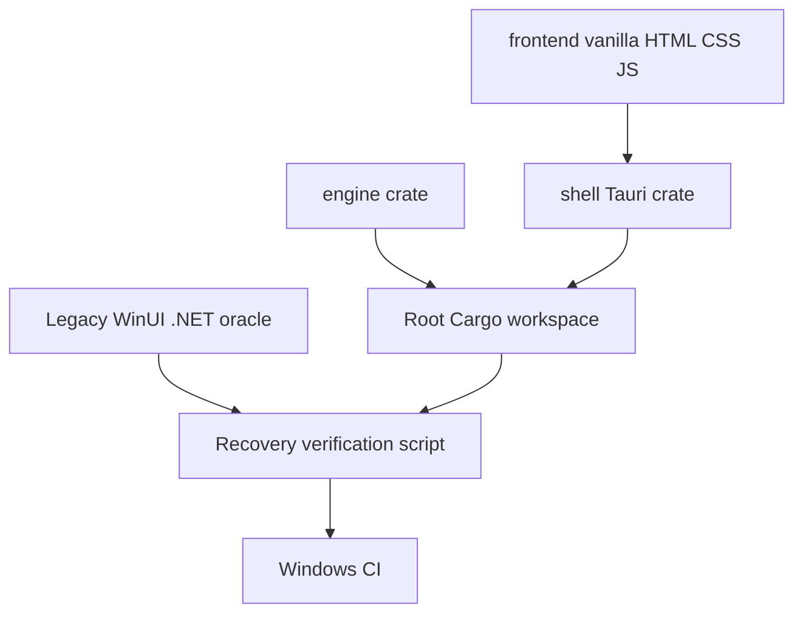

# Recover execution after the Tauri pivot

## Summary

Turn the documented Tauri pivot into an executable, independently verifiable P0 foundation.
This establishes one canonical build path, a runnable desktop shell, and CI gates before any
further product work continues on the new architecture.

## Problem Frame

The last production code landed on 2026-06-13 in the WinUI 3/.NET and Rust `cdylib` architecture.
On 2026-07-02, `STRATEGY.md`, `docs/technical-requirements.md`, and the Tauri migration documents
locked a different architecture: a Tauri desktop shell, Rust in-process backend, and web frontend.
No migration code followed. The repository consequently has two incompatible sources of truth:

- `app/`, `core/`, `cli/`, and `engine/` still build the original WinUI 3 + C# + wgpu/FFI product.
- The strategy declares the wgpu renderer and C# shell non-shipping, with xterm.js in a Tauri
  webview replacing them.
- There is no root Cargo workspace, Tauri app, frontend package, migration test command, or CI.

This plan intentionally executes only P0 recovery. It creates the durable runway for the existing
P1-P7 migration design; it does not attempt a dangerous partial port of the capacity governor,
named-pipe protocol, or terminal engine.

---

## Requirements

### Canonical direction

- R1. The repository must make the Tauri/Rust/web target executable, not only documented.
- R2. The legacy WinUI 3 product remains a tested compatibility oracle until the migration plan's
  P5 crash-safety gate and P7 cutover are complete; no legacy code is deleted in this recovery.
- R3. The current dashboard prototype is preserved as a visual reference, but it must not become
  a new WinUI feature branch after the pivot.

### Runnable foundation

- R4. A root Cargo workspace must declare the existing engine and a new `shell/` Tauri crate.
- R5. The shell must launch an Optimus-branded Tauri window with the reference dashboard's dark
  token background and no release-console window.
- R6. The frontend must have one deterministic local development/build/test command, with plain
  HTML/CSS/JavaScript as selected in `docs/design/tauri-migration-plan.md`.

### Progress and verification

- R7. A single recovery command must run legacy regression tests plus the new Rust/frontend
  checks without building two unrelated release artifacts.
- R8. Windows CI must enforce formatting, Rust tests, frontend checks, and the legacy regression
  net during the side-by-side period.
- R9. Documentation must state the exact P0 completion evidence and name P1 as the next allowed
  execution unit.

---

## Key Technical Decisions

- KTD1. **Execute P0, not a speculative slice of P1-P4.** The migration plan already fixes the
  destination and order. A runnable scaffold is the smallest unit that resolves the stall without
  duplicating business logic across C# and Rust.
- KTD2. **Preserve legacy sources as the oracle.** `core/` capacity, split, notifications, IPC,
  and CLI tests remain green on every recovery change. Their Rust ports start only in P2, test-first.
- KTD3. **Use the documented vanilla web frontend.** The existing dashboard prototype and
  `docs/design/web-overlay-palette/tokens.css` establish plain DOM/CSS/JS; adding React would be
  new architecture unrelated to the pivot.
- KTD4. **Let Tauri own the Windows webview profile.** Configure its per-user data directory in
  `shell/tauri.conf.json`; do not revive the abandoned direct WebView2/WinUI surface route.
- KTD5. **Treat unavailable package tooling as an explicit external prerequisite.** The Tauri CLI
  and npm packages must be installed from their upstream registries; do not create look-alike
  manifests or claim P0 passed until those tools can run.

---

## High-Level Technical Design

The Tauri shell is deliberately a thin P0 window. It owns branding, the webview user-data
directory, and the frontend bundle only. It does not yet invoke the C# domain, the FFI engine,
or the named-pipe server. Those boundaries move in the sequence already established by P1-P3.

---

## Implementation Units

### U1. Freeze the architectural boundary and legacy oracle

- **Goal:** Make the pivot operationally unambiguous and preserve the completed dashboard work as
  a reference rather than extending the non-target shell.
- **Files:** Modify `README.md`, `CLAUDE.md`, `docs/plans/2026-06-04-BUILD-TRACKER.md`; create
  `docs/design/dashboard-reference.md`.
- **Approach:** Add a concise side-by-side migration notice, point contributors to the P0 commands,
  and record the dashboard reference layout/tokens without deleting the current legacy prototype.
- **Patterns:** Follow the existing tracker session-log format and `DESIGN.md` token vocabulary.
- **Test scenarios:** Documentation links resolve to repo-relative files; the legacy build/test
  commands remain unchanged.
- **Verification:** A reviewer can identify the shipping target, oracle role, and next unit from
  repository-root documentation alone.

### U2. Create the Tauri P0 workspace and dashboard shell

- **Goal:** Add the smallest runnable Windows Tauri app, rooted in a Cargo workspace and using a
  vanilla frontend that renders the selected dashboard composition.
- **Files:** Create `Cargo.toml`, `shell/Cargo.toml`, `shell/build.rs`, `shell/src/main.rs`,
  `shell/tauri.conf.json`; create `frontend/package.json`,
  `frontend/index.html`, `frontend/src/main.js`, `frontend/src/tokens.css`,
  `frontend/src/style.css`.
- **Approach:** Use Tauri 2 with the release `windows_subsystem` attribute, a fixed app data
  directory, and a Vite static bundle. Port only the dashboard's visual language to DOM/CSS;
  do not bind terminal, pipe, or capacity behavior yet.
- **Patterns:** Mirror `docs/design/web-overlay-palette/tokens.css` and the layout established in
  `app/Dashboard/DashboardView.cs`; use the P0 Tauri configuration from
  `docs/design/tauri-migration-plan.md`.
- **Test scenarios:** Frontend type/build check succeeds; `cargo check -p optimus-shell` succeeds;
  a release build contains the Windows GUI subsystem setting; the frontend has no raw colors outside
  its token file.
- **Verification:** `npm run check`, `npm run build`, and `cargo tauri dev` launch the dashboard
  shell on Windows.

### U3. Add a single recovery verification command and Windows CI

- **Goal:** Replace the undocumented gap between old and new stacks with a repeatable gate.
- **Files:** Modify `build/build.ps1`; create `.github/workflows/windows.yml`; create
  `frontend/scripts/check-tokens.mjs`.
- **Approach:** Add a `-VerifyMigration` mode that runs legacy C# tests, engine tests, the new
  frontend checks, and the new shell check in dependency order. CI runs those same commands on
  `windows-latest`; release packaging stays out of this first gate.
- **Patterns:** Reuse the current `build/build.ps1` error handling and `tests/Design/TokensGuardTests.cs`
  enforcement posture.
- **Test scenarios:** A token violation makes the frontend checker fail; a successful run reports
  every gate; the existing engine and C# suite still execute unchanged.
- **Verification:** `build/build.ps1 -VerifyMigration` succeeds locally and the workflow parses.

---

## Scope Boundaries

- **Deferred to P1:** removing FFI/wgpu and streaming PTY bytes into the webview.
- **Deferred to P2:** all C# domain ports, especially capacity-model semantics and test migration.
- **Deferred to P3:** named-pipe, job-object, and CLI migration.
- **Deferred to P4:** live terminal panes, capacity binding, splits, notifications, and control-plane
  functionality.
- **Out of scope:** deleting `app/`, `core/`, `cli/`, or `tests/`; new provenance-memory features;
  reimplementing the dashboard's sample agent/cost data as a fake backend.

---

## Risks and Dependencies

- **Tauri tooling packages are not installed locally.** U2 requires registry access to install the
  Tauri CLI and JavaScript dependencies. If that access is unavailable, implementation stops at U1
  and records the exact prerequisite rather than creating unbuildable scaffolding.
- **WebView2 availability.** P0 uses Tauri's development runtime. Evergreen bootstrap and clean-VM
  validation remain P6 gates.
- **Two-stack confusion returning.** U1 and U3 make side-by-side status and commands explicit;
  no product feature should land in the legacy shell unless it fixes the oracle.

---

## Acceptance Examples

- AE1. Given a fresh clone with Rust, Node, and the declared dependencies installed, when a
  contributor runs the P0 development command, then a dark Optimus desktop dashboard appears with
  no release console window.
- AE2. Given a pull request during migration, when Windows CI runs, then the legacy C# tests,
  engine tests, frontend checks, and Tauri shell check all pass before merge.
- AE3. Given a contributor reading `README.md`, when they choose the next task, then they are sent
  to P1 engine slim-down rather than adding features to the legacy WinUI shell.

---

## Verification Matrix

| Requirement | Evidence |
|---|---|
| R1-R3 | Updated root docs, migration tracker, and dashboard reference |
| R4-R6 | Root workspace, shell crate, frontend package, runnable Tauri window |
| R7-R8 | `build/build.ps1 -VerifyMigration` and `.github/workflows/windows.yml` |
| R9 | P0 completion entry and explicit P1 handoff in tracker |

## Verified Outcome

On 2026-07-20, `build/build.ps1 -VerifyMigration` passed the legacy engine suite (25 Rust
tests), the legacy C# suite (252 tests), the Tauri shell formatting and compile checks, and the
frontend token/build checks. `npx --prefix frontend tauri build --config shell/tauri.conf.json
--no-bundle` also produced `target/release/optimus-shell.exe`. The migration now has an executable
P0 and a CI-enforced side-by-side gate; P1 engine slim-down is the next execution unit.
