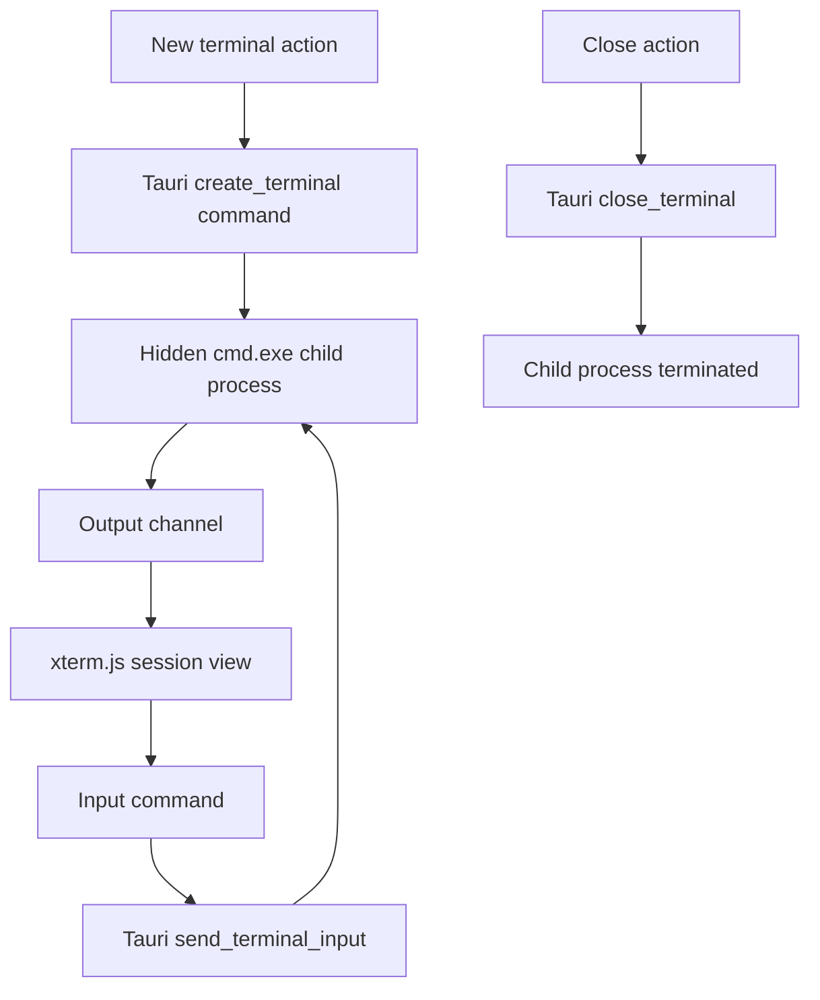

# Make the Tauri workspace executable

## Summary

Replace the P0 sample dashboard with a real local terminal workspace: it opens with zero sessions,
creates hidden Windows command-shell processes on demand, streams output into browser terminals,
and lets the user select or close each session.

## Problem Frame

The current frontend is a static visual reference. Its sample workspaces, agents, capacity values,
and activity feed do not correspond to backend state, so the application does not yet behave as a
terminal product.

---

## Requirements

- R1. The application starts with zero terminal sessions and an explicit empty-state action.
- R2. Creating a terminal starts a local Windows command-shell process without a console window,
  streams its output to the selected terminal, and accepts user input.
- R3. The workspace can select and close sessions; closing terminates the owned child process.
- R4. The interface exposes only live session information. It must not present sample agents,
  activity, spend, or a safe-capacity value as real product state.
- R5. Session-state behaviour and the frontend build remain verified in CI alongside the Tauri shell.

## Key Technical Decisions

- KTD1. Use a small Tauri-managed child-process bridge for this slice. It gives the application a
  real executable interface without reintroducing the old C# FFI or prematurely porting the full
  ConPTY/capacity engine.
- KTD2. Use xterm.js for the rendered terminal. The frontend holds display state while Rust owns
  process lifetime and input/output streams.
- KTD3. Treat the current fixed session limit as an interface guardrail, not the Optimus safe-zone
  governor. The exact capacity port remains migration P2 work.

## High-Level Technical Design

---

## Implementation Units

### U1. Add process-backed terminal commands

- **Goal:** Give the shell owned create, write, list, and close operations for local sessions.
- **Requirements:** R1, R2, R3, R4
- **Files:** `shell/src/main.rs`, `shell/Cargo.toml`
- **Approach:** Keep terminal processes in managed Tauri state, use a hidden `cmd.exe` with piped
  input/output, forward output through a Tauri channel, and kill every owned child on application
  exit.
- **Test scenarios:** Creating two sessions yields distinct IDs; writing targets the selected child;
  closing an unknown ID is harmless; application exit drains all children.
- **Verification:** The desktop app starts with no processes and an entered command visibly returns
  output in its own terminal.

### U2. Replace the sample dashboard with a live terminal workspace

- **Goal:** Render a zero-session empty state and live xterm.js sessions with create/select/close
  controls.
- **Requirements:** R1, R2, R3, R4
- **Dependencies:** U1
- **Files:** `frontend/package.json`, `frontend/src/main.js`, `frontend/src/style.css`,
  `frontend/src/session-state.js`, `frontend/src/terminal-workspace.js`
- **Approach:** Keep session selection in a small pure state module, map each backend session to a
  keyed xterm instance, and dispose it only after the backend confirms close.
- **Test scenarios:** Initial state is empty; creating selects the new session; closing the selected
  session selects its neighbour; empty state returns after the final close.
- **Verification:** New Terminal opens a live command shell, typing commands produces output, and
  close removes both the panel and sidebar entry.

### U3. Extend the migration gate

- **Goal:** Make the interactive workspace behaviour part of the normal recovery verification.
- **Requirements:** R5
- **Dependencies:** U1, U2
- **Files:** `frontend/src/session-state.test.mjs`, `frontend/package.json`, `build/build.ps1`
- **Approach:** Run Node's native tests before the existing frontend token/build checks; retain the
  current legacy oracle and Tauri compile gates.
- **Test scenarios:** The pure session-state cases pass together with the frontend build.
- **Verification:** `build/build.ps1 -VerifyMigration` succeeds with the new session tests.

## Scope Boundaries

- Deferred: ConPTY byte streaming, resize semantics, split trees, tabs, job objects, and the exact
  safe-capacity governor port. Those remain P1-P4 migration work.
- Out of scope: fabricated dashboard analytics or copying the incompatible large migration worktree.
